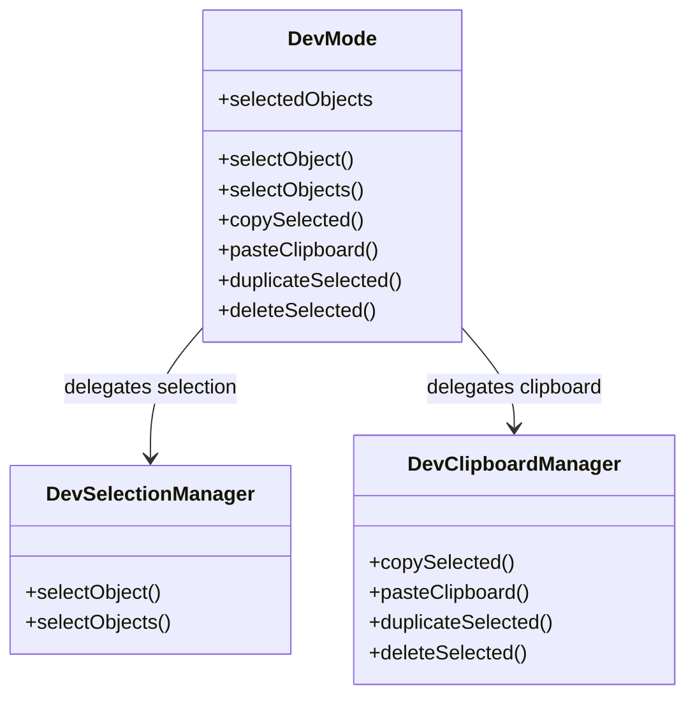
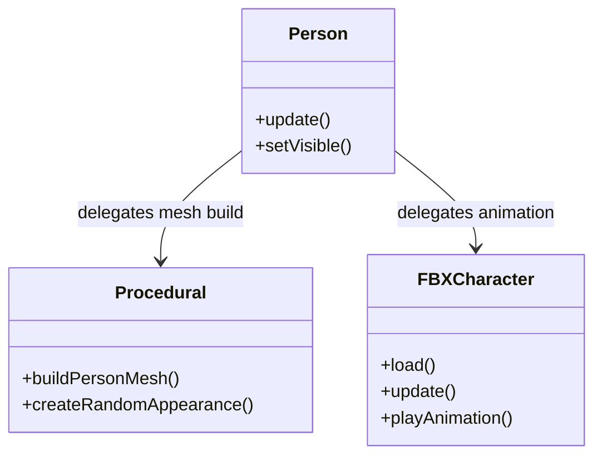

# Architecture Overview

## Dev Tools Structure

The dev tooling layer is centered on `DevMode` (`src/dev/devMode.js`), which coordinates
high-level editor state and delegates specialized responsibilities to focused managers.
This keeps selection, clipboard, and editing concerns modular while preserving the
public DevMode API used throughout the dev UI.

**Dependency direction**

- `DevMode` orchestrates editing behavior and state.
- `DevSelectionManager` owns selection state transitions and gizmo/UI sync.
- `DevClipboardManager` owns serialization, copy/paste/duplicate, and delete flows.

**Rule:** dev UI components should continue to call `DevMode` methods instead of
reaching into selection/clipboard internals, keeping dependency flow one-way.

## Person Entity Structure

The `Person` entity separates behavior from visual construction to maintain a clean entity class.

**Dependency direction**
- `Person` manages state (physics, input, lifecycle).
- `procedural` manages the static construction of the visual mesh.
- `FBXCharacter` manages 3rd party asset loading and animation mixing.

