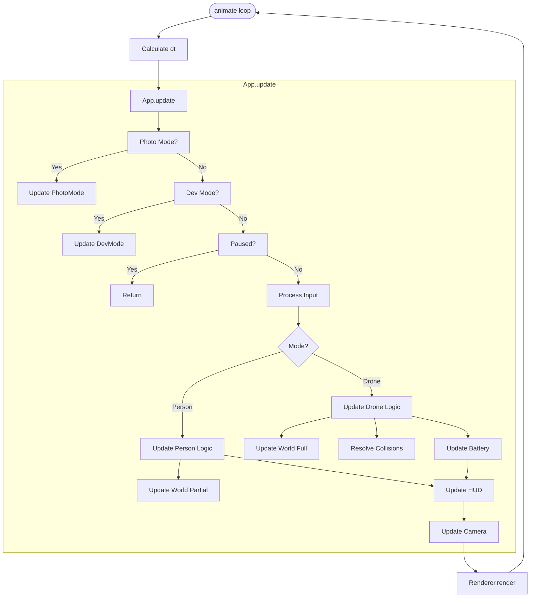

# App Core Architecture

**File:** `src/core/app.js`

## Overview
The `App` class serves as the central nervous system of the application. It orchestrates the initialization of all subsystems, manages the main game loop (`animate`), handles global state transitions (like switching between Person and Drone modes), and coordinates the loading of game worlds.

## Core Responsibilities

### 1. Initialization (`init`)
The `init()` method is the entry point called by `main.js`. It establishes the foundational systems in a specific order:
1.  **Rendering & Input:** `Renderer`, `InputManager`.
2.  **UI Systems:** `NotificationSystem`, `HUD`, `HelpSystem`, `MenuSystem`.
3.  **World & Physics:** `World`, `ParticleSystem`, `ColliderSystem`, `PhysicsEngine`.
4.  **Entities:** `Drone`, `Person`, `BatteryManager`, `RingManager`.
5.  **Environment:** `EnvironmentSystem` (Time/Weather).
6.  **Cameras:** `CameraController` (Drone), `PersonCameraController` (Person).
7.  **Post-Processing:** `PostProcessing`.
8.  **Modes:** `DevMode`, `PhotoMode`.

Finally, it starts the animation loop via `requestAnimationFrame(this.animate)`.

### 2. The Game Loop (`animate` & `update`)
The `animate(timestamp)` method calculates the delta time (`dt`) and calls `update(dt)` and `render(dt)`.

The `update(dt)` method is the heartbeat of the game logic. It routes updates based on the current state:

*   **Priority Updates:** `Photo Mode`, `Environment System` (Time Cycle), and `Dev Mode` are updated first. If Dev Mode is active, normal game logic is skipped.
*   **Input Handling:** Processes keyboard/mouse events via `InputManager`.
*   **Mode-Specific Logic:**
    *   **Person Mode:** Updates `Person` physics/movement, `World` (limited), `Particles`, and `Rings`.
    *   **Drone Mode:** Updates `Drone` physics, `Battery` drain, full `World` simulation (traffic, birds), collision detection (`PhysicsEngine`), and landing pad logic.
*   **Camera Updates:** Updates the active camera controller (`PersonCameraController` or `CameraController`).

### 3. State Management
The App manages high-level game states:
*   **`mode`**:
    *   `'person'`: First-person/Third-person walking simulator.
    *   `'drone'`: Flight simulation with battery constraints.
*   **`paused`**: Toggles the in-game menu and halts `update()` logic.
*   **`running`**: Boolean flag for the main loop.

### 4. Map Loading & History (`loadMap`)
The `loadMap(data)` method handles the complex task of initializing a level:
1.  **Hybrid Loading:** It intelligently merges the base map data with the user's edit history. Objects created in history are filtered out of the base load to prevent duplicates.
2.  **World Load:** Calls `this.world.loadMap()` to instantiate entities.
3.  **Physics Rebuild:** Clears and rebuilds the `ColliderSystem`.
4.  **History Replay:** If in Dev Mode, it replays the `undoStack` to restore the user's changes on top of the base map.
5.  **Game Reset:** Calls `_resetGame()` to position the player at a valid `PlayerStart` point.

## Logic Flow

## Key Dependencies
*   `src/world/world.js`: Manages the scene graph and entity lifecycle.
*   `src/drone/physics.js`: Handles collision resolution for the drone.
*   `src/dev/devMode.js`: The editor overlay system.
*   `src/core/input.js`: Abstraction for user input.
