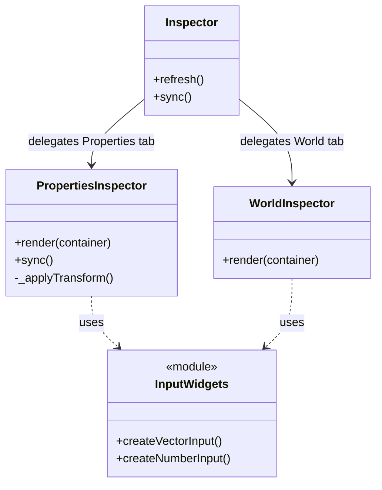

# Dev Mode Inspector UI

## Overview
The **Inspector** (`src/dev/ui/inspector.js`) is the primary interface for modifying object properties and world settings in the Level Editor. It dynamically generates UI controls based on the selected object's data and state.

## Architecture

The Inspector is a modular coordinator that manages tabs and delegates rendering to specialized sub-inspectors:
1.  **Properties Inspector** (`src/dev/ui/propertiesInspector.js`): Context-sensitive controls for selected objects.
2.  **World Inspector** (`src/dev/ui/worldInspector.js`): Global environment settings.
3.  **Widgets** (`src/dev/ui/widgets/inputs.js`): Reusable UI components (Vector3, Number, etc.).

## Sub-Systems

### 1. Properties Inspector
Handles object selection, transformation, and parameter editing.
*   **Dynamic Reflection**: Iterates `object.userData.params` to generate inputs (Color, Number, Boolean).
*   **Multi-Selection**: Detects if multiple objects are selected and binds controls to the `GizmoProxy` instead of individual objects.
*   **Vehicle Integration**: Renders Waypoint controls ('Add', 'Remove') if the object is a vehicle.
*   **Synchronization**: The `sync()` method updates input values (like Position/Rotation) in real-time during gizmo manipulation without rebuilding the DOM.

### 2. World Inspector
Handles global environment variables found in `app.world`.
*   **Time**: Sliders for `timeCycle.time` and speed.
*   **Wind**: Controls for wind speed and direction.
*   **Gameplay**: Global settings like `batteryDrain`.

## Key Features

### Dynamic Parameter Reflection
For single-object selections, the Inspector automatically generates inputs:
| Data Type | Heuristic | Widget |
| :--- | :--- | :--- |
| **Color** | Key contains 'color' OR starts with '#' | `ColorPickerWidget` |
| **Number** | `typeof val === 'number'` | `createNumberInput` |
| **Boolean** | `typeof val === 'boolean'` | `createCheckbox` |

### History Integration
All property changes go through the Command System to support Undo/Redo:
*   **Transforms**: Generates `TransformCommand`.
*   **Parameters**: Generates `PropertyChangeCommand`.

## Dependencies
*   **Parent**: `src/dev/buildUI.js`
*   **Widgets**: `src/dev/ui/widgets/colorPicker.js`, `src/dev/ui/widgets/inputs.js`
*   **Systems**: `GizmoManager` (for Proxy), `CommandManager` (for History), `AlignTool`.
