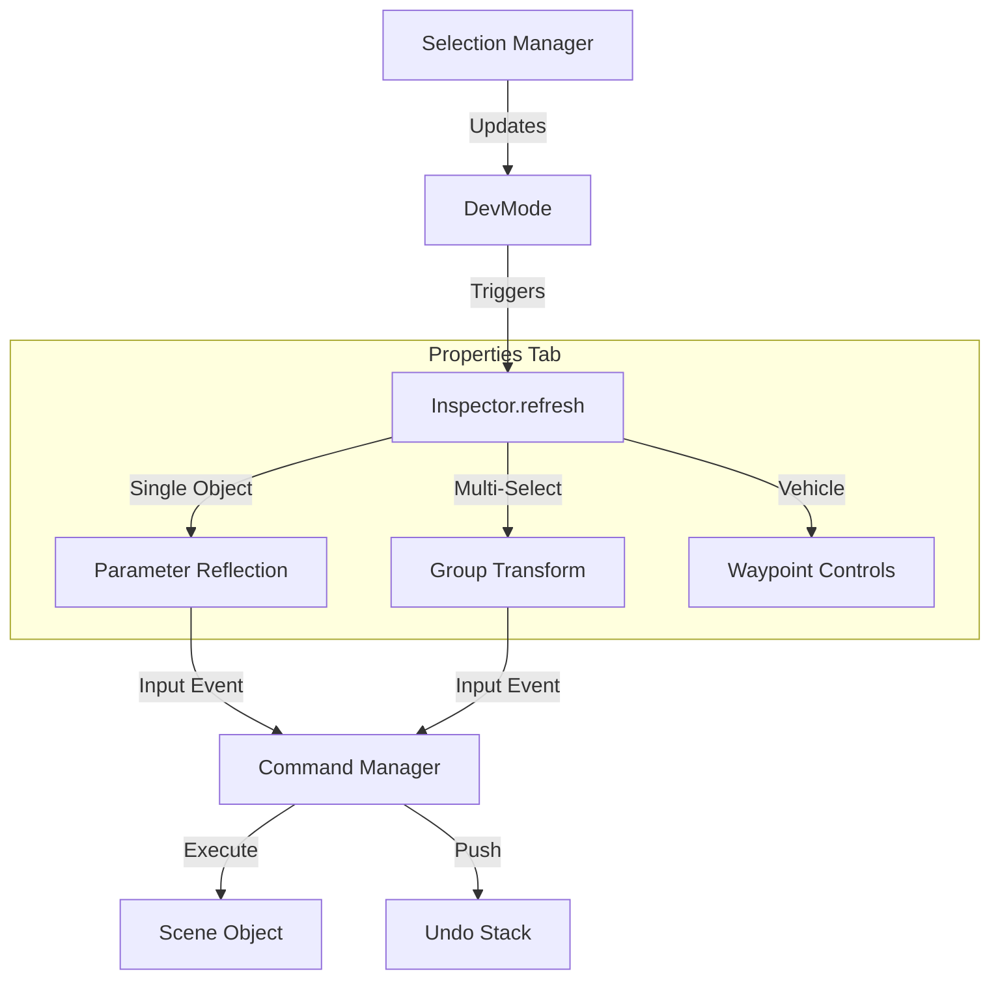

# Dev Mode Inspector UI

## Overview
The **Inspector** (`src/dev/ui/inspector.js`) is the primary interface for modifying object properties and world settings in the Level Editor. It dynamically generates UI controls based on the selected object's data and state.

## Architecture

The Inspector is a sub-component of `BuildUI` and operates in two modes (tabs):
1.  **Properties**: Context-sensitive controls for the currently selected object(s).
2.  **World**: Global environment settings (Time, Wind, Gameplay).

## Key Features

### 1. Dynamic Parameter Reflection
For single-object selections, the Inspector iterates through `object.userData.params` to generate inputs automatically. It uses naming conventions and type checks to select the appropriate widget:

| Data Type | Heuristic | Widget |
| :--- | :--- | :--- |
| **Color** | Key contains 'color' OR string starts with '#' | `ColorPickerWidget` (Hex + Swatch) |
| **Number** | `typeof val === 'number'` | Number Input |
| **Boolean** | `typeof val === 'boolean'` | Checkbox |
| **String** | `typeof val === 'string'` | Text Input |

**Developer Note:** To expose a new property to the editor, simply add it to `this.params` (or `userData.params`) in your Entity class. The Inspector ignores internal keys like `uuid`, `type`, `x`, `y`, `z`, `width`, `height`, `depth`.

### 2. Multi-Selection & Proxy
When multiple objects are selected, the Inspector:
*   Hides individual parameters.
*   Displays **"Transform (Group)"** controls.
*   Binds inputs to `devMode.gizmo.proxy` (the invisible object at the selection centroid).
*   **Synchronization**: Modifying these inputs triggers `_applyProxyTransform`, which updates the proxy and immediately calls `gizmo.syncProxyToObjects()` to propagate the delta to all selected entities.

### 3. Vehicle Integration
The Inspector includes hardcoded support for `VehicleEntity` types (`car`, `pickupTruck`, `bicycle`).
*   **Waypoints**: Adds "Add/Remove Waypoint" buttons.
*   **Wait Time**: dedicated input for `waitTime` if present in `userData`.

### 4. Integration with Tools
*   **Align Tool**: If the `AlignTool` is active (multi-selection), its UI is embedded directly into the Inspector panel via `alignTool.createUI()`.
*   **Lock Aspect Ratio**: The Scale input includes a "Lock" checkbox that forces uniform scaling (x=y=z) when any axis is modified.

## Data Flow & Synchronization

### The `sync()` Loop
During high-frequency operations (like dragging the Gizmo), rebuilding the entire DOM via `refresh()` is too slow.
*   **Method**: `Inspector.sync()`
*   **Usage**: Called every frame by `BuildUI.update` and by `GizmoManager` during drag events.
*   **Logic**: It finds existing input elements by ID (e.g., `#insp-Position-x`) and updates their `.value` to match the object's current transform, ensuring the UI stays responsive without losing focus.

### History Integration
All property changes go through the Command System to support Undo/Redo:
*   **Transforms**: Generates `TransformCommand`.
*   **Parameters**: Generates `PropertyChangeCommand`.

## Dependencies
*   **Parent**: `src/dev/buildUI.js`
*   **Widgets**: `src/dev/ui/widgets/colorPicker.js`
*   **Systems**: `GizmoManager` (for Proxy), `CommandManager` (for History), `AlignTool`.
