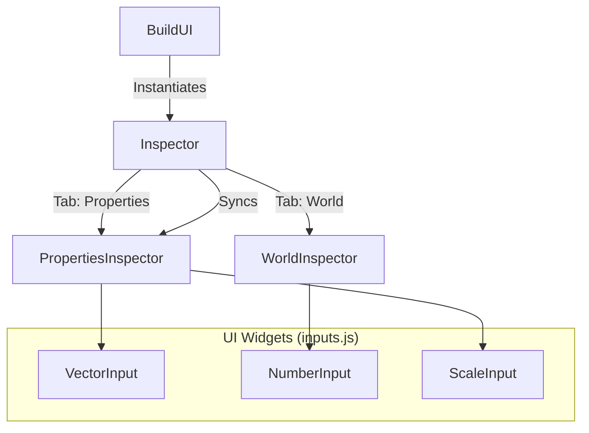

# Dev Mode Inspector UI

## Overview
The **Inspector** (`src/dev/ui/inspector.js`) is the primary interface for modifying object properties and world settings in the Level Editor. It dynamically generates UI controls based on the selected object's data and state.

## Architecture

The Inspector has been refactored (May 2026) into a modular system. `Inspector` acts as a coordinator, delegating specific logic to sub-inspectors based on the active tab.

### Components

1.  **Inspector** (`src/dev/ui/inspector.js`):
    *   Manages the top-level container and Tab switching (Properties vs World).
    *   Delegates `refresh()`, `sync()`, and `updateProperties()` calls to the active sub-inspector.

2.  **PropertiesInspector** (`src/dev/ui/inspector/propertiesInspector.js`):
    *   Handles the **Properties** tab.
    *   Manages selection state (Single vs Multi).
    *   Generates inputs for `Transform` and `userData.params`.
    *   Handles `lockScale` state.
    *   Interacts with `History` (Command System) and `GizmoManager`.

3.  **WorldInspector** (`src/dev/ui/inspector/worldInspector.js`):
    *   Handles the **World** tab.
    *   Provides controls for global systems: `TimeCycle`, `Wind`, `BatteryDrain`.

4.  **Input Widgets** (`src/dev/ui/widgets/inputs.js`):
    *   A collection of pure helper functions (`createVectorInput`, `createNumberInput`, etc.) that generate DOM elements.
    *   Decoupled from specific logic, accepting callbacks for value changes.

## Key Features

### 1. Dynamic Parameter Reflection (PropertiesInspector)
For single-object selections, the Inspector iterates through `object.userData.params` to generate inputs automatically. It uses naming conventions and type checks to select the appropriate widget:

| Data Type | Heuristic | Widget |
| :--- | :--- | :--- |
| **Color** | Key contains 'color' OR string starts with '#' | `ColorPickerWidget` (Hex + Swatch) |
| **Number** | `typeof val === 'number'` | Number Input |
| **Boolean** | `typeof val === 'boolean'` | Checkbox |
| **String** | `typeof val === 'string'` | Text Input |

### 2. Multi-Selection & Proxy
When multiple objects are selected, `PropertiesInspector`:
*   Hides individual parameters.
*   Displays **"Transform (Group)"** controls.
*   Binds inputs to `devMode.gizmo.proxy`.
*   **Synchronization**: Modifying these inputs triggers `_applyProxyTransform`.

### 3. Data Flow & Synchronization
*   **Method**: `sync()`
*   **Usage**: Called every frame by `BuildUI.update`.
*   **Logic**: `PropertiesInspector.sync()` updates existing DOM elements (found by ID) to match the object's current transform. IDs for transform inputs are stable (e.g., `#insp--Position-x`).

## Dependencies
*   **Parent**: `src/dev/buildUI.js`
*   **Widgets**: `src/dev/ui/widgets/`
*   **Systems**: `GizmoManager`, `CommandManager`, `AlignTool`.
