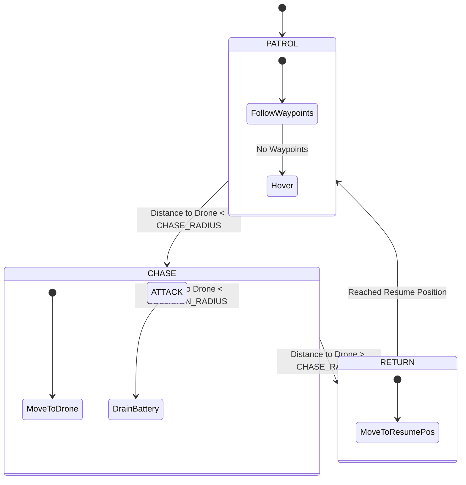

# Bird System Documentation

## Overview

The **Bird System** (`src/world/birdSystem.js`) manages the lifecycle, AI behavior, and animation of all `BirdEntity` instances in the world. Unlike static props, birds are dynamic actors that can patrol routes, chase the player, and return to their stations.

## Architecture

The system decouples the **Entity** (visuals/data) from the **System** (logic/behavior).

*   **`BirdEntity` (`src/world/entities/creatures.js`)**:
    *   Defines the visual mesh (Body + Wings).
    *   Stores persistence data (Start Position, Waypoints).
    *   Flagged as `isVehicle = true` to enable Waypoint editing in Dev Mode.
*   **`BirdSystem` (`src/world/birdSystem.js`)**:
    *   Maintains a list of active bird instances.
    *   Executes the State Machine for each bird every frame.
    *   Handles collision detection with the Drone.

## State Machine

Each bird operates on a simple Finite State Machine (FSM):



### States

1.  **PATROL** (Default):
    *   Behavior: Follows a list of waypoints defined in `userData.waypoints`.
    *   Fallback: If no waypoints exist, hovers at `startPos`.
    *   Trigger: Switches to **CHASE** if the drone enters `CHASE_RADIUS`.

2.  **CHASE**:
    *   Behavior: Flies directly towards the drone's current position.
    *   Trigger: Switches to **RETURN** if the drone escapes (`dist > CHASE_RADIUS`).
    *   Interaction: If `dist < COLLISION_RADIUS`, it drains the drone's battery.

3.  **RETURN**:
    *   Behavior: Flies back to the position where it left the **PATROL** state (`resumePos`).
    *   Trigger: Switches back to **PATROL** upon reaching the destination.

## Configuration

Behavior is tuned via `CONFIG.BIRD` in `src/config.js`.

| Parameter | Description |
|-----------|-------------|
| `SPEED` | Flight speed in meters/second. |
| `CHASE_RADIUS` | Distance at which a bird detects and chases the drone. |
| `COLLISION_RADIUS` | Distance required to register a hit/attack. |
| `BATTERY.DRAIN_COLLISION` | Amount of battery drained per second during contact. |

## Animation

The system applies procedural animation in `_updateBird()`:
*   **Movement**: Position updates via `addScaledVector`.
*   **Orientation**: `lookAt(target)` ensures the bird faces its destination.
*   **Flapping**: Oscillates `wings.position.y` using `Math.sin(time)` to simulate wing beats.

## Usage

### Adding a Bird
Birds are added via the standard `EntityRegistry` or Dev Mode.

```javascript
// Example: Creating a bird programmatically
const bird = new BirdEntity({
    x: 0, y: 10, z: 0,
    waypoints: [{x: 10, y: 10, z: 0}, {x: -10, y: 10, z: 0}]
});
world.addEntity(bird);
```

### Dev Mode Integration
*   **Placement**: Drag & Drop from the "Creatures" category.
*   **Waypoints**: Select the bird and use the "Add Waypoint" tool (inherited from `VehicleEntity` logic).
