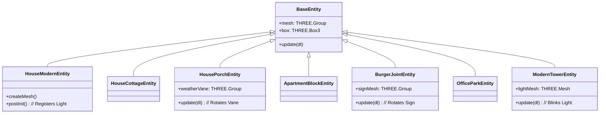

# Buildings System

## Overview
The Buildings System creates the structural environment of Drone City, ranging from small residential houses to massive commercial skyscrapers. These entities are primarily static, serving as obstacles, landing zones, and visual landmarks. They extend `BaseEntity` and often utilize procedural texture generation to create variety without external assets.

## Architecture

All buildings inherit from `BaseEntity`. Some incorporate specific behavior (like rotating signs or blinking lights) via the `update(dt)` method.

## Residential Buildings
Defined in `src/world/entities/residential.js`.

### 1. Modern House (`house_modern`)
A minimal architectural style featuring flat roofs, clean lines, and large glass surfaces.
*   **Visuals**: Concrete main block with a contrasting wood/dark accent block. Large emissive window.
*   **Lighting**: Registers a warm white (`0xFFCCAA`) virtual light near the window via `LightSystem`.
*   **Procedural**: Accent block color is randomized (Wood vs Dark Grey).

### 2. Cottage House (`house_cottage`)
A traditional style with brick walls and a steep roof.
*   **Visuals**: Brick texture (`TextureGenerator.createBrick`), steep conical roof (pyramid style), and a chimney.
*   **Structure**: Includes a distinct door mesh.

### 3. Porch House (`house_porch`)
A detailed suburban home with a covered porch and decorative elements.
*   **Visuals**: Siding texture (`TextureGenerator.createBuildingFacade`) in random pastel colors.
*   **Features**:
    *   Covered porch with steps and awning.
    *   Planter boxes with randomized multi-colored flowers.
    *   Mailbox on a post.
    *   Side-mounted AC unit with fan.
*   **Animation**: A rooftop **Weather Vane** that rotates slowly in the wind.

### 4. Apartment Block (`apartment_block`)
A multi-story residential structure.
*   **Visuals**: 3-story walk-up with a tan brick facade.
*   **Features**:
    *   Multiple balconies per floor.
    *   Entrance canopy.
*   **Lighting**: Registers a cool white (`0xDDEEFF`) virtual light under the entrance canopy.

---

## Commercial Buildings
Defined in `src/world/entities/commercial.js`.

### 1. Burger Joint (`burger_joint`)
A small fast-food establishment.
*   **Visuals**: Orange-tinted concrete walls with a red roof.
*   **Animation**: A large rotating sign on a tall pole. The sign rotates continuously in `update(dt)`.
*   **Lighting**: Registers an orange (`0xffaa00`) virtual light near the sign to illuminate it at night.

### 2. Office Park (`office_park`)
A medium-density commercial building with an L-shaped layout.
*   **Visuals**: Generic office facade with blue-tinted windows.
*   **Structure**: Composed of a main block and an offset wing block. Includes rooftop HVAC units.
*   **Procedural**: Height varies slightly (3-4 stories).

### 3. Modern Tower (`modern_tower`)
A large skyscraper acting as a city landmark.
*   **Visuals**: Hexagonal tiered design using `CylinderGeometry` (6 segments).
*   **Structure**: 3 tiers of decreasing radius, topped with an antenna.
*   **Material**: Transparent/Reflective glass material (`opacity: 0.9`).
*   **Animation**: A red warning light on the antenna tip blinks (sine wave pattern) in `update(dt)`.

## Configuration
Common parameters accepted by `createMesh(params)`:

| Parameter | Type | Default | Description |
| :--- | :--- | :--- | :--- |
| `width` | Number | Varies | Width (X-axis) of the building base. |
| `height` | Number | Varies | Height (Y-axis). Some entities (Office, Tower) override this with procedural ranges. |
| `depth` | Number | Varies | Depth (Z-axis). |

## Dependencies
*   **TextureGenerator**: Used heavily for brick, concrete, and facade textures (`src/utils/textures.js`).
*   **LightSystem**: Buildings register virtual lights (`window.app.world.lightSystem`) for night-time illumination.
*   **BaseEntity**: Inherits collision and lifecycle management (`src/world/entities/base.js`).
