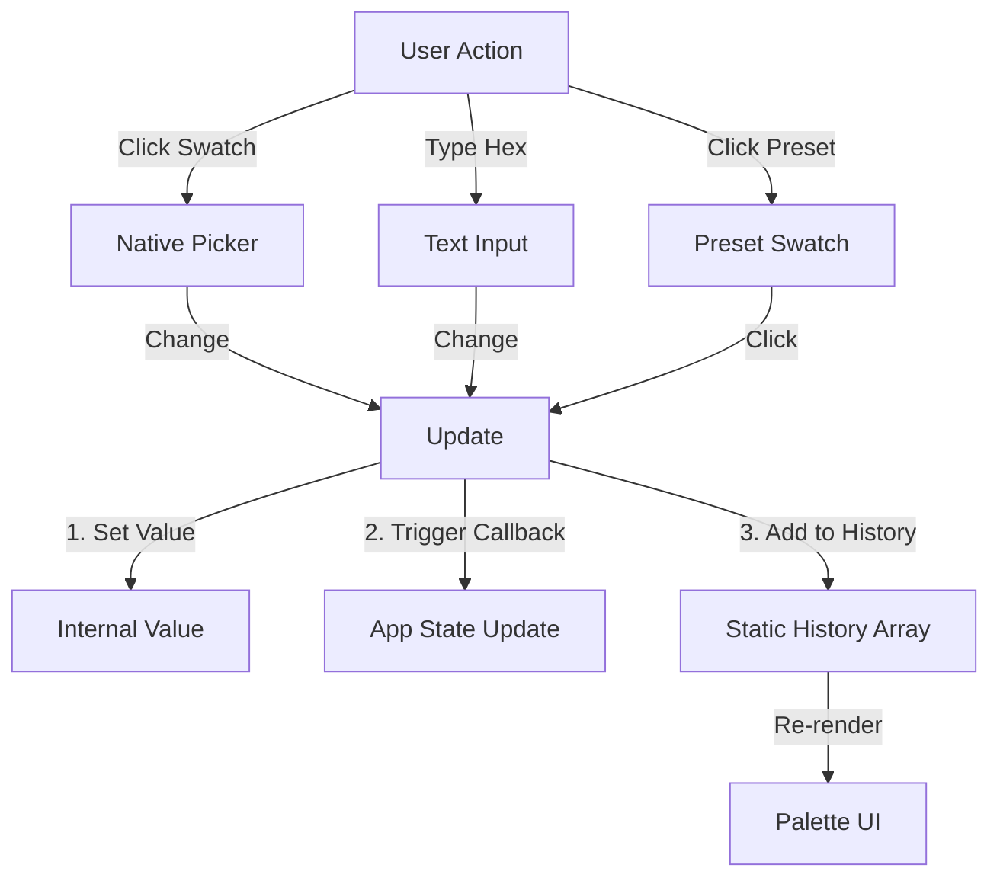

# Color Picker Widget

## Overview
The `ColorPickerWidget` is an enhanced UI component for selecting colors in the Developer Inspector. It provides a standard color input, hex code text entry, and a palette system featuring both common presets and a recent color history.

## Usage
The widget is primarily used within the `Inspector` class to render any property identified as a color.

```javascript
import { ColorPickerWidget } from './widgets/colorPicker.js';

const widget = new ColorPickerWidget('Light Color', '#ff0000', (newColor) => {
    // Callback with new hex string or integer
    light.color.set(newColor);
});
document.body.appendChild(widget.element);
```

## Features

### 1. Dual Input
- **Visual Picker**: Wraps the native `<input type="color">` for system-native color selection (wheel, sliders, etc.).
- **Hex Input**: Text field for direct Hex code entry (e.g., `#FF5500`). Validates and updates the visual picker automatically.

### 2. Presets Palette
- Displays a row of 8 standard colors (Red, Green, Blue, Yellow, Cyan, Magenta, White, Black).
- Allows single-click assignment of common values.

### 3. Shared History
- Automatically tracks the last 8 selected colors.
- **Shared State**: History is static across all instances of the widget. If you pick a color for one object, it becomes available in the history for the next object you inspect.
- **Auto-Update**: The history list updates immediately upon color confirmation (change event).

## Architecture

### Logic Flow


## CSS Classes
Styling is handled in `src/style.css`.
- `.dev-color-wrapper`: Main container.
- `.dev-color-palette`: Container for preset/history rows.
- `.dev-color-mini-swatch`: The clickable small squares.

## Dependencies
- `src/style.css`: Required styles.
- `three`: Used for `THREE.Color` hex string conversion utilities.
