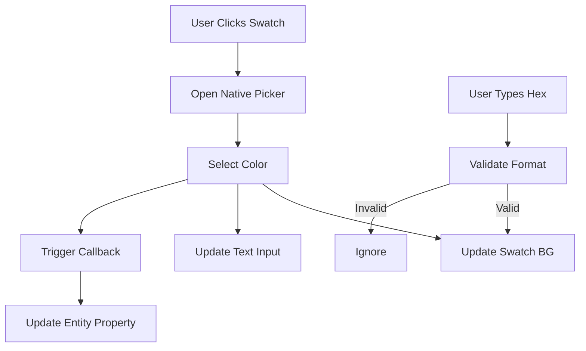

# Color Picker Widget

## Overview
The **Color Picker Widget** is a UI component designed for the Developer Tools Inspector. It provides a user-friendly interface for modifying color properties of entities (e.g., Lights, Neon Signs) using a visual color swatch and hex input.

## Features
- **Visual Swatch:** Displays the current color.
- **Native Integration:** Opens the operating system's native color picker when clicked.
- **Hex Input:** Allows precise manual entry of hex codes.
- **Type Safety:** Automatically detects if the target property is a Number (`0xRRGGBB`) or String (`"#RRGGBB"`) and maintains the type on update.

## Usage

### Integration in Inspector
The `Inspector` class automatically uses the `ColorPickerWidget` for any property key containing "color" (case-insensitive) or explicit color values.

```javascript
import { ColorPickerWidget } from './widgets/colorPicker.js';

// Inside Inspector._renderProperties
if (key.toLowerCase().includes('color')) {
    const widget = new ColorPickerWidget(key, val, (newVal) => {
        this._applyParam(obj, key, newVal);
    });
    group.appendChild(widget.element);
}
```

### Supported Formats
1. **Hex Number:** `0xff00ff` (Common in Three.js)
2. **Hex String:** `"#ff00ff"` (CSS/HTML standard)

## Dependencies
- `src/style.css`: Requires `.dev-color-swatch` and `.visually-hidden` classes.
- `src/dev/ui/widgets/colorPicker.js`: The widget implementation.

## Visual Flow

