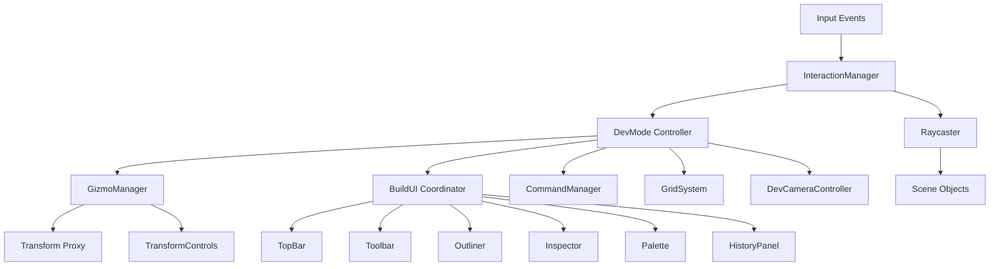

# Developer Tools Architecture

## Overview
The Developer Mode (`DevMode`) functions as an in-game level editor, allowing developers and designers to build the game world directly within the engine. It provides tools for object placement, manipulation, map management, and specific gameplay logic configuration (like vehicle paths).

## Architecture

The system is built around a central controller (`DevMode`) that coordinates several specialized subsystems. The architecture separates input handling, visual manipulation, and UI rendering.



### Core Components

#### 1. DevMode (`src/dev/devMode.js`)
The central hub. It maintains the state of the editor (enabled/disabled), the current selection (`selectedObjects`), and coordinates the lifecycle of other systems.
*   **Responsibilities**: Toggling state, managing selection lists, applying transforms from history, serializing/deserializing maps.

#### 2. InteractionManager (`src/dev/interaction.js`)
Handles raw mouse inputs (mousedown, mousemove, mouseup) and Drag & Drop events.
*   **Raycasting**: Determines which object is under the cursor.
*   **Drag Logic**: Distinguishes between dragging an object, dragging the Gizmo, or dragging a new object from the palette.
*   **Logic**: It ensures that clicks on the UI or Gizmo handles do not trigger object selection.

#### 3. GizmoManager (`src/dev/gizmo.js`)
Wraps Three.js `TransformControls` to provide visual translation, rotation, and scale handles.
*   **Proxy Pattern**: When multiple objects are selected, the Gizmo does not attach to them directly. Instead, it positions an invisible "Proxy" object at the centroid of the selection. The `TransformControls` manipulate this Proxy.
*   **Sync**: The `updateObjectsFromProxy()` method calculates the offset of each selected object relative to the Proxy and applies the new transform, enabling group manipulation.

#### 4. BuildUI (`src/dev/buildUI.js`)
The UI Coordinator. It manages the lifecycle of the DOM-based overlay components located in `src/dev/ui/`.
*   **TopBar (`src/dev/ui/topBar.js`)**: Main menu (File, Edit, View).
*   **Toolbar (`src/dev/ui/toolbar.js`)**: Quick access buttons (Undo/Redo, Grid).
*   **Outliner (`src/dev/ui/outliner.js`)**: Scene graph list showing categorized entities.
*   **Inspector (`src/dev/ui/inspector.js`)**: Properties panel for selected objects and environment settings.
*   **Palette (`src/dev/ui/palette.js`)**: Asset browser for drag-and-drop object creation.
*   **HistoryPanel (`src/dev/ui/historyPanel.js`)**: Visual list of undo/redo stack.

#### 5. CommandManager (`src/dev/history.js`)
Implements the Command Pattern for Undo/Redo functionality.
*   **Commands**: `TransformCommand`, `CreateObjectCommand`, `DeleteObjectCommand`, `WaypointCommand`.
*   **Snapshots**: Uses deep cloning (or simplified state objects) to capture the state of objects "before" and "after" an operation.

---

## Key Workflows

### Object Creation (Drag & Drop)
Standard placement for simple objects (e.g., trees, buildings).
1.  **Event**: User drags an item from the Palette (HTML `dragstart`).
2.  **Drop**: `InteractionManager` listens for `drop` on `document.body`.
3.  **Raycast**: Calculates the world position on the ground or existing objects.
4.  **Factory**: Calls `EntityRegistry.create()` to instantiate the mesh.
5.  **Registration**: Adds the entity to `World` (for logic) and `ColliderSystem` (for physics).

### Smart Placement Tool (Anchor & Stretch)
Used for variable-length infrastructure (Roads, Fences) or specific placements activated via UI buttons.
1.  **Activation**: The tool enters `placementMode` (e.g., 'road').
2.  **Anchor (MouseDown)**: The user clicks to set the starting point (Anchor). `InteractionManager` creates a temporary "Ghost Mesh".
3.  **Stretch (MouseMove)**: As the user drags, the tool calculates the vector from Anchor to Current Mouse Position.
    *   **Axis Locking**: If Grid Snap is enabled, the tool forces the vector to align with the X or Z axis.
    *   **Integer Snapping**: For roads, the length is rounded to the nearest integer to ensure texture alignment.
    *   **Visuals**: The Ghost Mesh is scaled and rotated in real-time to preview the result.
4.  **Place (MouseUp)**: The object is finalized with the calculated position, rotation, and scale. The collider is rebuilt to match the new dimensions.

### Selection & Transformation
1.  **Click**: `InteractionManager` raycasts to find a mesh.
2.  **Select**: Calls `DevMode.selectObject()`.
3.  **Attach**: `GizmoManager` calculates the selection centroid and moves the Proxy there.
4.  **Manipulate**: User drags the Gizmo handles. `GizmoManager` updates the Proxy.
5.  **Propagate**: Every frame during drag, `syncProxyToObjects()` applies the Proxy's delta matrix to all selected objects.
6.  **Commit**: On `mouseup`, a `TransformCommand` is pushed to history.

### Waypoint System
Vehicles (Cars, Pickups) use a waypoint system for pathfinding.
*   **Visuals**: `VehicleEntity` contains a `waypointGroup` (lines and spheres) stored in `userData`. This group is only visible when Dev Mode is active.
*   **Editing**: Selecting a car reveals "Add Waypoint" buttons in the `BuildUI` properties panel.
*   **Logic**: Waypoints are `Vector3`s stored in `userData.waypoints`. The visual line is rebuilt whenever these change.

---

## Data & Serialization

Maps are saved as JSON files. The `DevMode._serializeMesh()` method converts runtime objects into a data schema:
```json
{
  "type": "car",
  "position": { "x": 0, "y": 0, "z": 0 },
  "rotation": { "x": 0, "y": 0, "z": 0 },
  "scale": { "x": 1, "y": 1, "z": 1 },
  "params": { "width": 2, "height": 2 }
}
```
When loading, `App.loadMap` clears the world and iterates this list, asking `EntityRegistry` to recreate the entities.

---

## Keyboard Shortcuts

| Key | Action |
| :--- | :--- |
| **`** (Backtick) | Toggle Dev Mode |
| **W, A, S, D** | Move Camera (Free Fly) |
| **Q, E** | Move Camera Up/Down |
| **Right Mouse** | Rotate Camera (Look) |
| **Shift + Click** | Multi-Select Objects |
| **Delete** | Delete Selection |
| **Ctrl + Z** | Undo |
| **Ctrl + Y** | Redo |
| **Ctrl + C** | Copy Selection |
| **Ctrl + V** | Paste Selection |
| **Ctrl + D** | Duplicate Selection |
