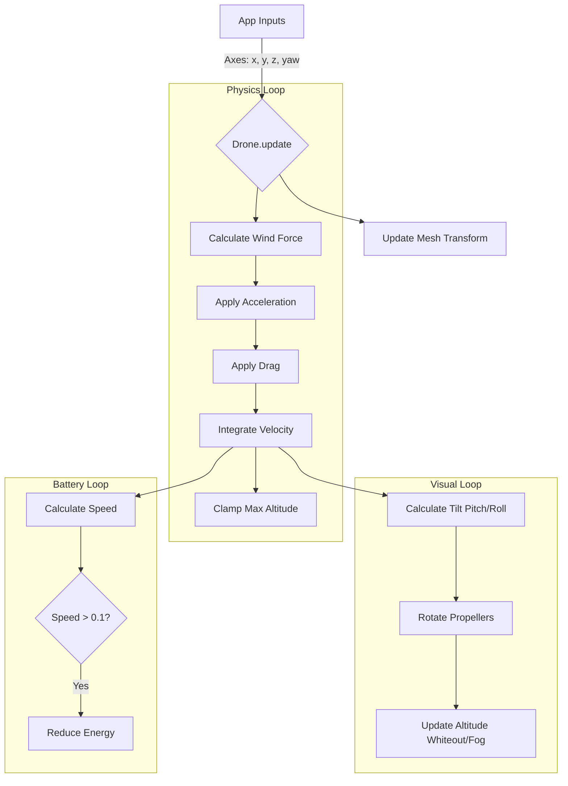

# Drone System Architecture

## Overview
The **Drone System** defines the behavior, physics, and construction of the player's primary vehicle. Unlike the standard `VehicleEntity` used for traffic, the Drone is a highly specialized kinematic character controller built for precise, arcade-style flight.

It consists of two main components:
1.  **`Drone`** (`src/drone/drone.js`): Handles physics, input integration, and visual effects.
2.  **`BatteryManager`** (`src/drone/battery.js`): Manages the energy economy, drain logic, and recharging.

## Architecture

The system follows a "Physics-First, Visual-Second" update order, with Battery logic acting as a limiter.

## Physics Model

The drone uses a custom kinematic solver rather than a rigid body simulation. This allows for "snappy" controls suitable for a game where precision is key.

### Movement Logic
*   **Horizontal**: Input `(x, z)` is rotated by the drone's current `yaw`.
*   **Vertical**: Input `(y)` directly modifies vertical acceleration.
*   **Integration**:
    $$ v_{new} = v_{old} + (Acceleration + Wind - Drag) \cdot dt $$
*   **Drag**: Separate coefficients for horizontal (`CONFIG.DRONE.DRAG`) and vertical (`CONFIG.DRONE.VERTICAL_DRAG`) motion allow tuning ascent/descent feel independently of forward speed.

### Wind Influence
Wind is applied as an additive force vector based on `CONFIG.WORLD.WIND` (or `world.wind` at runtime).
*   **Direction**: Converted from degrees (0=North) to a vector.
*   **Force**: $F_{wind} = Direction \cdot Speed \cdot 2.0$.

### Constraints
*   **Max Altitude**: Capped at `CONFIG.DRONE.MAX_ALTITUDE` (120m).
*   **Ceiling Response**: Velocity is clamped to 0 when hitting the ceiling to prevent "sticking".

## Visual Hierarchy

The visual representation separates the "Physics Transform" (Yaw/Position) from the "Visual Tilt" (Pitch/Roll) to prevent control inversions.

| Component | Class | Responsibility |
|-----------|-------|----------------|
| **`mesh`** | `THREE.Group` | **Root**. Follows physics position and Yaw rotation. Use this for collisions/tracking. |
| **`tiltGroup`** | `THREE.Group` | **Child of mesh**. Applies procedural Pitch/Roll based on acceleration. |
| **Geometry** | `Mesh` | Procedural shapes (Fuselage, Arms, Props) attached to `tiltGroup`. |

### Procedural Construction
The drone model is generated entirely in code using Three.js primitives (`CapsuleGeometry`, `CylinderGeometry`) to avoid external asset dependencies.
*   **Arms**: X-configuration.
*   **Propellers**: 4 independent meshes rotating based on velocity.
*   **Gimbal**: Front-facing camera assembly.

## Battery System

The `BatteryManager` implements a "Movement = Cost" mechanic.

*   **Drain Rule**: Energy is consumed *only* when the velocity magnitude exceeds `0.1`. Hovering or rotating in place costs nothing.
*   **Drain Rate**:
    *   **Default**: `CONFIG.BATTERY.DRAIN_RATE` (2.0 units/sec).
    *   **Override**: `world.batteryDrain` (set via `PlayerStartEntity` params in Dev Mode).
*   **Depletion**: When energy hits 0, the `depleted` flag is set. The App layer forces a descent, and once the drone touches down it hands control back to the person mode.

## Altitude Effects (Whiteout)

To discourage flying too high and hiding the edge of the world map, a visual "Whiteout" effect triggers as the drone approaches `MAX_ALTITUDE`.

*   **Overlay**: A full-screen HTML `div` fades to white.
*   **Fog**: `THREE.FogExp2` is dynamically added/adjusted to obscure the horizon.
*   **Dev Mode Bypass**: If `window.app.devMode.enabled` is true, these effects are disabled to allow developers to inspect the map freely.

## Configuration Parameters

All constants are defined in `src/config.js` under `CONFIG.DRONE` and `CONFIG.BATTERY`.

| Parameter | Default | Description |
|-----------|---------|-------------|
| `ACCELERATION` | 26.0 | Horizontal acceleration force. |
| `DRAG` | 2.8 | Air resistance (higher = snappier stop). |
| `TILT_MAX` | 0.3 | Visual tilt in radians at max speed. |
| `MAX_ALTITUDE` | 120 | Height ceiling in meters. |
| `DRAIN_RATE` | 2.0 | Energy loss per second while moving. |
