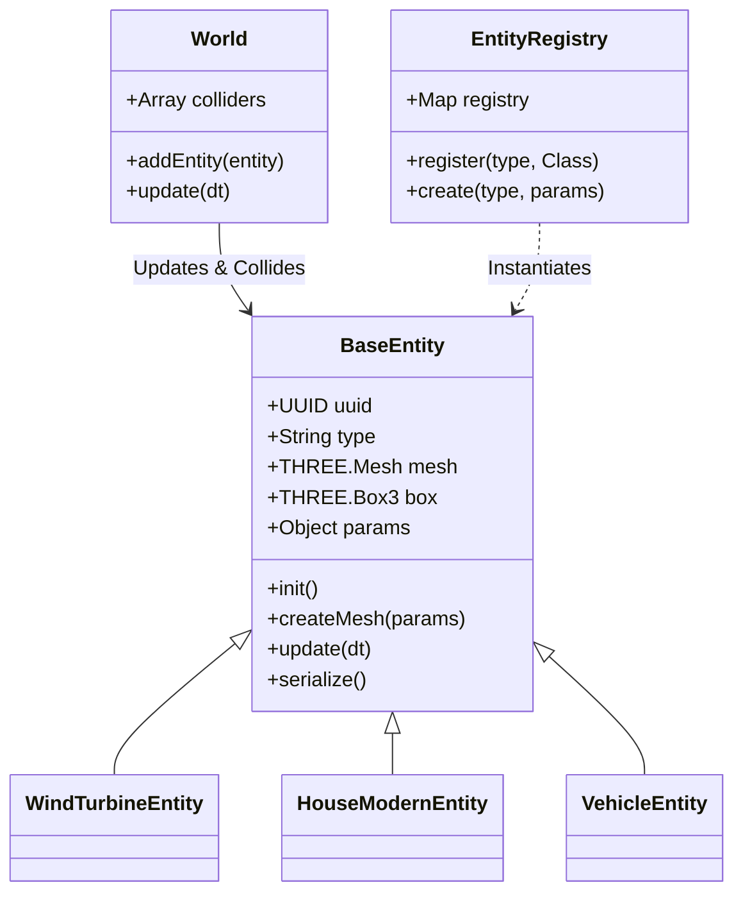

# Entity System Documentation

## Overview

The **Entity System** is the foundation for all objects in the game world, including buildings, vehicles, props, and nature elements. It provides a standardized interface for:
*   Creation and Lifecycle Management
*   Collision Detection (Integration with `ColliderSystem`)
*   Update Loops (Animation)
*   Serialization (Saving/Loading maps)
*   Developer Mode Integration (UI properties, Drag & Drop)

## Architecture

The system is built on a Factory and Registry pattern.



### Key Components

1.  **`BaseEntity` (`src/world/entities/base.js`)**: The parent class for all world objects. It handles:
    *   **Positioning**: Applies `x, y, z` and `rotX, rotY, rotZ` from parameters.
    *   **Identity**: Generates a persistent `UUID` and assigns `userData.type`.
    *   **Physics**: Automatically generates an AABB (Axis-Aligned Bounding Box) for the `ColliderSystem`.
    *   **Serialization**: Exports its state to JSON.

2.  **`EntityRegistry` (`src/world/entities/registry.js`)**: A static registry that maps string keys (e.g., `'windTurbine'`) to JavaScript Classes.
    *   Used by the Map Loader and Developer Mode to instantiate objects by name.

3.  **Registration (`src/world/entities/index.js`)**:
    *   Uses Vite's `import.meta.glob('./*.js', { eager: true })` to automatically load all entity files.
    *   **Requirement**: Every entity file *must* call `EntityRegistry.register('type', ClassName)` at the bottom of the file.

---

## Creating a New Entity

To add a new object to the game, follow these steps:

### 1. Create the File
Create a new file in `src/world/entities/` (e.g., `myProp.js`).

### 2. Implement the Class
Extend `BaseEntity` and implement `createMesh(params)`.

```javascript
import * as THREE from 'three';
import { BaseEntity } from './base.js';
import { EntityRegistry } from './registry.js';

export class MyPropEntity extends BaseEntity {
    constructor(params) {
        super(params);
        this.type = 'myProp'; // Unique identifier
    }

    // Name shown in Dev Mode Palette
    static get displayName() { return 'My Prop'; }

    createMesh(params) {
        // 1. Create Geometry
        const geo = new THREE.BoxGeometry(2, 2, 2);

        // 2. Create Material (Reusable/Standard)
        const mat = new THREE.MeshStandardMaterial({ color: 0xff0000 });

        // 3. Create Mesh
        const mesh = new THREE.Mesh(geo, mat);

        // 4. IMPORTANT: Shadows
        mesh.castShadow = true;
        mesh.receiveShadow = true;

        return mesh;
    }
}

// 5. Register
EntityRegistry.register('myProp', MyPropEntity);
```

### 3. Export (Optional but Recommended)
Add the export to `src/world/entities/index.js` to ensure the module is included in the build and available to other systems if needed directly.

### 4. Advanced: Animations
Override the `update(dt)` method to add per-frame logic.

```javascript
update(dt) {
    if (this.mesh) {
        // Rotate continuously
        this.mesh.rotation.y += dt;
    }
}
```

### 5. Advanced: Custom Properties (Dev Mode)
To expose properties in the Dev Mode UI, use the `params` object.

*   **In Code**: `const speed = params.speed || 10;`
*   **In UI**: Any value in `this.mesh.userData.params` is accessible.
*   **Validation**: Ensure you handle missing params with defaults.

---

## Lifecycle & Updates

1.  **Instantiation**: `EntityRegistry.create('type', params)` calls `new Entity(params)`.
2.  **Initialization**: `entity.init()` is called immediately.
    *   `createMesh(params)` is executed.
    *   Transforms are applied.
    *   `postInit()` hook is called (useful for child setup).
    *   `createCollider()` calculates the bounding box.
3.  **Registration**: `World.addEntity(entity)` adds it to the `colliders` list.
4.  **Loop**: `World.update(dt)` iterates `colliders` and calls `entity.update(dt)` if it exists.

## Serialization

The `BaseEntity.serialize()` method automatically handles standard transforms and `params`.
*   **Input**: `params` passed to constructor.
*   **Runtime**: `mesh.userData.params` acts as the source of truth for edited values.
*   **Output**: JSON object with `type`, `position`, `rotation`, `scale`, and `params`.

**Note**: If you have dynamic state (like `waitTime` or `speed`) that changes at runtime, ensure you update `this.mesh.userData.params` so it saves correctly.

## Dependencies

*   **`src/world/colliders.js`**: Reads `entity.box` and `entity.mesh` for collision detection.
*   **`src/dev/buildUI.js`**: Reads `entity.constructor.displayName` for the Palette.
*   **`src/dev/devMode.js`**: Uses `EntityRegistry` to spawn dragged objects.

## Specialized Systems

Some entities require logic that goes beyond simple self-updates or need to interact with global game state (like the Drone). These are managed by specialized systems:

*   **[Bird System](./bird_system.md)**: Manages `BirdEntity` instances, handling AI states (Patrol, Chase) and battery interactions.
*   **[NPC System](./npc_system.md)**: Manages active agents like `AngryPersonEntity`, detailing their behaviors, configuration, and combat logic.
*   **[Time Cycle](./time_cycle.md)**: Manages the `Sun` and global lighting, though not strictly an "entity" in the registry sense.
*   **[World Generation](./world_generation.md)**: Uses the `ObjectFactory` adapter to procedurally generate the initial city layout using `EntityRegistry` types.
