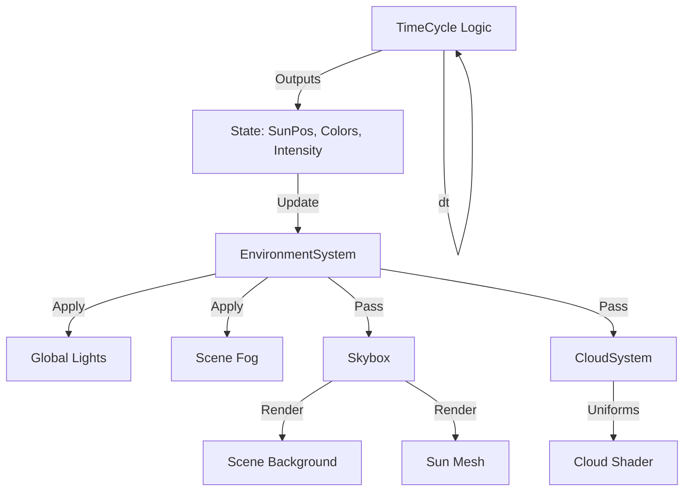

# Environment System Documentation

## Overview

The Environment System manages the atmospheric and celestial visuals of the game world, creating a dynamic day-night cycle. It consists of coordinated components, led by an `EnvironmentSystem` orchestrator:

1.  **EnvironmentSystem** (`src/world/environmentSystem.js`): Owns global lighting, skybox, and cloud updates.
2.  **TimeCycle** (`src/world/timeCycle.js`): The logical clock and state manager for sun/moon position and color palettes.
3.  **Skybox** (`src/world/skybox.js`): Renders the infinite background and celestial bodies (Sun).
4.  **CloudSystem** (`src/world/clouds.js`): Renders a procedural, infinite cloud layer using custom shaders.

The `EnvironmentSystem` is instantiated by `App` and receives `TimeCycle` state every frame to update global lighting and sky visuals.

## Architecture

Data flows from the `TimeCycle` (Logic) to the Visual Systems (`Skybox`, `Clouds`) and the Global Renderer (`App`).



## Components

### 1. Skybox (`src/world/skybox.js`)

Unlike a traditional cube-mapped skybox, this system is procedural.

*   **Background**: Directly manipulates `scene.background` (THREE.Color) based on the time of day (e.g., Blue at noon, Orange at sunset, Black at night).
*   **Sun Mesh**: A physical `THREE.Mesh` (Sphere) with a `MeshBasicMaterial` (toneMapped: false).
    *   **Positioning**: To simulate infinite distance, the sun mesh is repositioned every frame to `CameraPosition + (SunDirection * 400)`. This keeps it inside the camera's far clip plane (500) but always at a fixed angle relative to the viewer.

### 2. CloudSystem (`src/world/clouds.js`)

Renders a dynamic cloud layer using `THREE.ShaderMaterial` on a massive `PlaneGeometry` (4000x4000).

*   **Geometry**: A single plane rotated -90° on X (horizontal).
*   **Movement**: The plane is locked to the Camera's X/Z position but fixed at Y=200 (Altitude). This creates the illusion of an infinite canopy as the player moves.
*   **Shader Logic**:
    *   **Noise**: Uses Fractional Brownian Motion (FBM) and Value Noise to generate organic patterns.
    *   **Wind**: Offsets the noise coordinates over time based on the global `wind` configuration.
    *   **Lighting**: Simulates sun scattering (silver lining) using the dot product of the View Vector and Sun Vector.
    *   **Fading**: A radial alpha mask fades the edges of the plane to transparent to hide the square geometry at the horizon.

#### Key Uniforms
| Uniform | Source | Description |
| :--- | :--- | :--- |
| `uTime` | `dt` accumulation | Drives the wind scrolling animation. |
| `uSunPosition` | `TimeCycle` | Direction of the sun for lighting calculations. |
| `uSunColor` | `TimeCycle` | Color of the direct light hitting the clouds. |
| `uAmbientColor` | `TimeCycle` | Base color of the clouds in shadow. |
| `uWind` | `World.wind` | Vector2 derived from wind speed/direction. |

### 3. Integration with TimeCycle

The `TimeCycle` calculates colors based on keyframes (Dawn, Noon, Dusk, Midnight). The Environment System reads these values in `update()`:

*   **Sky Color**: Interpolated background color.
*   **Sun Color**: Tints the Sun Mesh and Cloud Highlights.
*   **Ambient Color**: Tints the Cloud Shadows.

## Usage

The system is instantiated in `App.init()` and updated in the main loop.

```javascript
// App.js Initialization
this.environment = new EnvironmentSystem(this.renderer);

// App.js Update Loop
this.environment.updateCycleAndLighting(dt, this.world.timeCycle);
this.environment.updateVisuals(
    dt,
    this.renderer.camera,
    this.drone,
    this.world.wind,
    this.world.timeCycle
);
```

## Configuration

*   **Cloud Altitude**: Fixed at Y=200 in `CloudSystem.update`.
*   **Sun Distance**: Fixed at 400 units in `Skybox.update`.
*   **Wind**: Configured via `CONFIG.WORLD.WIND` or Dev Mode UI, passed to `CloudSystem`.
