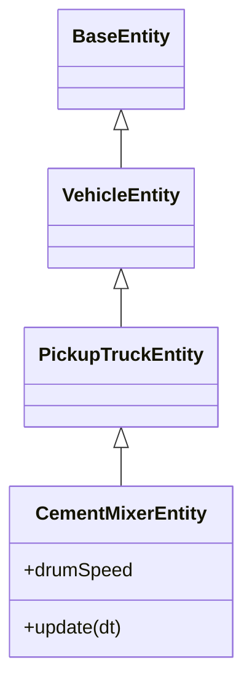

# Industrial System

The Industrial System comprises a set of heavy machinery and logistical entities that populate the industrial zones of the city. These entities often feature complex hierarchical animations, particle effects, and procedural texturing.

## 1. Entities

### FactoryEntity
*   **Type:** `factory`
*   **Source:** `src/world/entities/factory.js`
*   **Description:** A large industrial complex featuring a main warehouse, roof vents, pipes, and active smokestacks.
*   **Parameters:**
    *   `width`: Width of the main building (default: 40).
    *   `depth`: Depth of the main building (default: 30).
    *   `height`: Height of the main building (default: 12).
*   **Visuals:**
    *   **Structure:** Main concrete block with a yellow "caution" stripe.
    *   **Details:** Randomly scattered roof vents and side-attached pipes.
    *   **Smokestacks:** Multi-segment cylinders (grey/white/red) that emit particle smoke.
*   **Animation:**
    *   **Smoke:** `update(dt)` animates a pool of recycled `THREE.IcosahedronGeometry` particles. Particles rise, fade in (scale up), and reset when they reach a max height.

### CraneEntity
*   **Type:** `crane`
*   **Source:** `src/world/entities/crane.js`
*   **Description:** A tall tower crane used for construction sites.
*   **Parameters:**
    *   `height`: Vertical tower height (default: 30).
    *   `jibLength`: Horizontal arm length (default: 20).
    *   `rotationSpeed`: Speed of the jib's rotation (default: 0.1).
    *   `color`: Main structure color (default: Construction Yellow).
*   **Animation:**
    *   The jib (arm) rotates slowly around the Y-axis in `update(dt)`.

### WindTurbineEntity
*   **Type:** `windTurbine`
*   **Source:** `src/world/entities/windTurbine.js`
*   **Description:** A renewable energy generator with a tall mast and rotating 3-blade propeller.
*   **Parameters:**
    *   `towerHeight`: Height of the mast (default: 40).
    *   `bladeLength`: Length of each blade (default: 15).
    *   `bladeSpeed`: Rotation speed of the rotor (default: 1.0).
*   **Animation:**
    *   **Rotor:** Continuous rotation on the X-axis.
    *   **Nacelle:** Slow oscillating yaw (rotation around Y) to simulate wind direction tracking.

### OilPumpJackEntity
*   **Type:** `oilPumpJack`
*   **Source:** `src/world/entities/oilPumpJack.js`
*   **Description:** A "nodding donkey" oil pump with a complex mechanical linkage animation.
*   **Parameters:**
    *   `pumpSpeed`: Animation speed (default: 2.0).
    *   `color`: Paint color (default: Rusty Orange).
*   **Animation:**
    *   Implements a mechanical simulation in `update(dt)`:
    *   **Crank:** Rotates continuously.
    *   **Beam:** Rocks up and down via sine wave derived from crank position.
    *   **Pitman Arm:** Connects crank to beam (visual approximation).
    *   **Polished Rod:** Moves vertically at the "Horse Head" end of the beam.

### CementMixerEntity
*   **Type:** `cementMixer`
*   **Source:** `src/world/entities/cementMixer.js`
*   **Inheritance:** `BaseEntity` -> `VehicleEntity` -> `PickupTruckEntity` -> `CementMixerEntity`
*   **Description:** A specialized vehicle combining truck logic with a rotating mixing drum.
*   **Behaviors:**
    *   **Movement:** Inherits traffic logic (path following, stopping for obstacles) from `PickupTruckEntity`.
    *   **Drum:** The mixing drum rotates continuously in `update(dt)` regardless of vehicle speed.
*   **Visuals:** Includes a striped drum, discharge chute, and extra wheel axles.

### ShippingContainerEntity
*   **Type:** `shippingContainer`
*   **Source:** `src/world/entities/shippingContainer.js`
*   **Description:** A standardized intermodal container used in ports and industrial yards.
*   **Parameters:**
    *   `lengthType`: 20 or 40 (feet). Controls length (6m vs 12m).
    *   `color`: Hex color (randomly selected from presets like Maersk Blue, Rusty Red).
    *   `logoText`: Company name stamped on the side (e.g., "MAERSK", "JULES-XP").
*   **Procedural Texturing:**
    *   Uses `_createCorrugatedTexture()` to generate a `CanvasTexture` at runtime.
    *   **Features:** Vertical gradients for corrugation depth, noise layers for rust, and stenciled text with borders.
