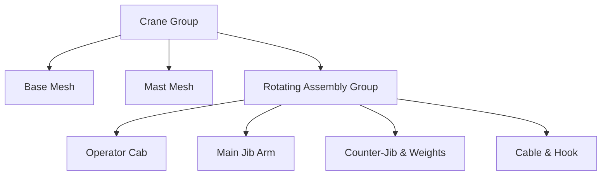

# Industrial System

## Overview

The Industrial System encompasses the entities responsible for the "heavy industry" aesthetic of Drone City. These objects typically feature complex, multi-part hierarchies, continuous mechanical animations, and specific particle effects.

Unlike simple static props, these entities often require `update(dt)` loops to drive their visual components (rotors, cranes, smoke).

## Entities

### 1. Factory (`factory`)
*   **Source:** `src/world/entities/factory.js`
*   **Description:** A large modular manufacturing facility.
*   **Visuals:**
    *   **Main Building:** Concrete block with a "Caution" yellow stripe.
    *   **Smokestacks:** A pair of multi-segment towers (Base, White, Red top).
    *   **Pipes:** Torus arches connecting to the wall.
    *   **Vents:** Scattered rooftop HVAC units.
*   **Animation:**
    *   **Smoke Particles:** Uses a simple particle system (`this.smokeParticles`).
    *   Particles spawn at the top of smokestacks, rise (`offsetY`), scale up (`p.scale`), and reset when they reach `maxHeight`.

### 2. Construction Crane (`crane`)
*   **Source:** `src/world/entities/crane.js`
*   **Description:** A tower crane used in construction zones.
*   **Structure:**
    *   **Base & Mast:** Static concrete/steel support.
    *   **Rotating Assembly:** The top part that spins. Contains the Cab, Jib, and Counter-Jib.
    *   **Jib:** The long arm holding the hook.
    *   **Counterweights:** Concrete blocks on the rear arm.
*   **Animation:** The `rotatingAssembly` group rotates continuously around the Y-axis based on `rotationSpeed`.

### 3. Cement Mixer (`cementMixer`)
*   **Source:** `src/world/entities/cementMixer.js`
*   **Parent:** `PickupTruckEntity` (Vehicle)
*   **Description:** A functional vehicle with a rotating concrete drum.
*   **Visuals:**
    *   **Chassis:** Standard truck base.
    *   **Drum:** Tilted cylinder with spiral stripes for visual rotation feedback.
    *   **Chute:** Discharge chute at the rear.
*   **Animation:**
    *   **Movement:** Inherits traffic logic (PingPong/Waypoints) from `VehicleEntity`.
    *   **Drum:** The `drumPivot` group rotates on its local Z-axis (`drumSpeed`) independent of vehicle movement.

### 4. Wind Turbine (`windTurbine`)
*   **Source:** `src/world/entities/windTurbine.js`
*   **Description:** A renewable energy generator with a massive rotating blade assembly.
*   **Visuals:**
    *   **Tower:** Tapered cylinder.
    *   **Nacelle:** The housing at the top, capable of yaw rotation.
    *   **Rotor:** Hub with 3 blades (120° separation) and red tips.
*   **Animation:**
    *   **Blades:** `rotorGroup` spins on X-axis.
    *   **Yaw:** `nacelleYaw` oscillates slowly (sine wave) to simulate wind direction adjustments.

## Related Entities

*   **[Oil Pump Jack](./entities/oil_pump_jack.md)**: A fully animated nodding donkey pump.
*   **[Pulse Reactor](./entities/pulseReactor.md)**: Sci-fi energy generator with shader-based effects.
