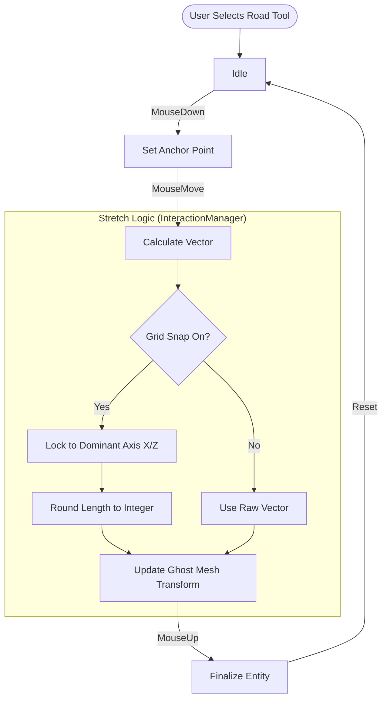

# Infrastructure System

## Overview
The Infrastructure System manages the static, structural elements of the city, specifically Roads, Rivers, and Sidewalks. Unlike standard props, these entities often require variable dimensions and specialized interaction tools to place them effectively on the grid.

## Smart Road Tool

The "Smart Road Tool" utilizes an **Anchor & Stretch** interaction pattern within the `InteractionManager` to allow rapid creation of road segments. This ensures roads are perfectly aligned and scaled to integer units, preventing texture stretching and alignment gaps.

### Interaction Flow



### Key Logic ([src/dev/interaction.js](../src/dev/interaction.js))
*   **Anchor**: The point where the user first clicks (`mousedown`).
*   **Axis Locking**: If `Grid Snap` is enabled, the tool compares `dx` and `dz`. If `abs(dx) > abs(dz)`, it snaps `dz` to 0, forcing a perfect East-West alignment.
*   **Integer Snapping**: The length of the road is strictly rounded to the nearest integer (min 1.0). This is critical for the procedural texture generation to align its repeating pattern correctly.

## Entities

### RoadEntity ([src/world/entities/infrastructure.js](../src/world/entities/infrastructure.js))
The backbone of the city's grid.
*   **Geometry**: `THREE.PlaneGeometry` created with a base length of 1 unit.
*   **Scaling**: The actual length of the road is defined by the Mesh `scale.z`.
*   **Texture**: Uses `asphalt_v2` from `TextureGenerator`.
*   **Visual Consistency**: The `update(dt)` loop calls `updateTexture()`, which dynamically sets `material.map.repeat.y`.
    *   Formula: `repeat.y = (Base Length * Scale Z) / 10`.
    *   Result: The dashed yellow line texture repeats every ~10 units, ensuring lines look identical on a 10m road vs a 100m road.

### SidewalkEntity
A fixed-dimension modular block for pedestrian paths.
*   **Dimensions**: 1m (Width) x 0.2m (Height) x 5m (Length).
*   **Texture**: `createSidewalk` generates a procedural concrete pattern with horizontal grooves.
*   **Alignment**: The texture grooves are offset by half a segment height. This ensures that when the 5m-long object is centered on the integer grid, the visual grooves align with the world coordinate integers.

### RiverEntity
Currently implemented as a simple blue plane.
*   **Future**: Intended to be upgraded to use Splines/CatmullRom curves for organic flow.
*   **Current State**: Static plane with `MeshStandardMaterial`.

## Texture Generation ([src/utils/textures.js](../src/utils/textures.js))

Textures are generated procedurally at runtime using the Canvas API to avoid external asset dependencies.

*   **Asphalt V2**:
    *   Base: Dark Grey (`#1a1a1a`) with noise.
    *   Markings: Single Yellow Dash (`#FFC107`), centered.
    *   Dash/Gap Ratio: Designed to repeat seamlessly when tiled.

## Usage in Code

To programmatically create a road:

```javascript
// Example: Creating a 20-unit road
const road = EntityRegistry.create('road', { length: 1 }); // Base length 1
road.mesh.scale.set(1, 1, 20); // Scale to 20
road.updateTexture(road.mesh); // Fix UV repetition
world.addEntity(road);
```
