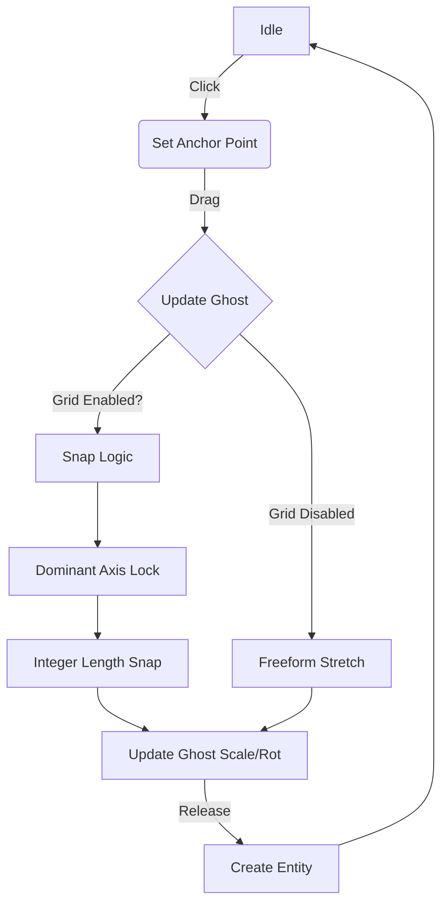

# Infrastructure System

The Infrastructure System manages the static, procedural elements of the city environment, primarily focusing on roads, sidewalks, and waterways. Unlike standard props, these entities often utilize dynamic geometry generation and custom interaction tools for placement.

## Core Entities

### RoadEntity
* **File**: `src/world/entities/infrastructure.js`
* **Type**: `road`
* **DisplayName**: "Road"

The `RoadEntity` is a procedural plane that generates a stretch of asphalt. It is designed to be placed via the [Smart Road Tool](#smart-road-tool) but can also be instantiated manually.

#### Key Characteristics
- **Geometry**: `THREE.PlaneGeometry` rotated flat (XZ plane).
- **Material**: Procedural Asphalt (Dark Grey + Yellow Dashed Line).
- **Texture Scaling**: The entity overrides `update(dt)` (or `updateTexture`) to adjust `material.map.repeat.y` based on the mesh's Z-scale (length). This ensures the dashed lines remain consistent (approx. 1 dash per 10 units) regardless of how long the road segment is.

#### Visuals
- **Texture Source**: `src/utils/textures.js` -> `createAsphalt()`
- **Resolution**: 256x256 (Procedural Canvas)
- **Pattern**: Dark noise background with a centered yellow dash.

### SidewalkEntity
* **File**: `src/world/entities/infrastructure.js`
* **Type**: `sidewalk`
* **DisplayName**: "Sidewalk"

A modular concrete walkway designed to snap alongside roads.

- **Dimensions**: 1.0 (W) x 0.2 (H) x 5.0 (L)
- **Geometry**: `THREE.BoxGeometry`
- **Materials**: Multi-material mesh.
  - Top: `createSidewalk` (Concrete with grooves)
  - Sides/Bottom: `createConcrete` (Plain noise)
- **Alignment**: Texture grooves are offset by half a segment to align visually with the world grid integers.

---

## Smart Road Tool

The **Smart Road Tool** is a specialized interaction mode in `DevMode` that allows for "Anchor & Stretch" placement of linear infrastructure. It supersedes the standard "Click to Place" logic for objects like Roads.

### Interaction Flow

The tool is managed by `InteractionManager` (`src/dev/interaction.js`).

### Grid Snapping Logic
When Grid Snap is enabled (Default in Dev Mode):
1. **Dominant Axis Lock**: The tool calculates the vector from the **Anchor** to the **Mouse Position**. It zeroes out the smaller component (X or Z) to enforce straight North-South or East-West lines.
2. **Integer Quantization**: The length is rounded to the nearest whole number (min 1.0).
3. **Strict Alignment**: Ensures that roads connect perfectly without gaps or overlapping texture artifacts.

### Ghost Preview
- Uses a temporary mesh with `GhostMaterial` (Green, Transparent).
- Dynamically scales the Z-axis of the mesh to match the intended length.
- Resets rotation to 0, 90, 180, or 270 degrees based on the drag direction.

## Technical Details

### Texture Generation (`src/utils/textures.js`)
Textures are generated procedurally on `HTMLCanvasElement` at runtime to avoid external assets and allow for infinite tiling without visible seams.

- **Asphalt V2**: Uses additive noise on a dark base. The yellow line is drawn explicitly in the center.
- **Performance**: Textures are cached in a `Map` based on parameters to prevent re-generation during bulk placement.

### Collision
- **Roads**: Use the default `BoxCollider` derived from the mesh bounding box. Since the mesh is a flat plane, the collider is effectively a thin box on the ground.
- **Sidewalks**: Full 3D Box collision (height 0.2), acting as a physical curb for vehicles and physics objects.
