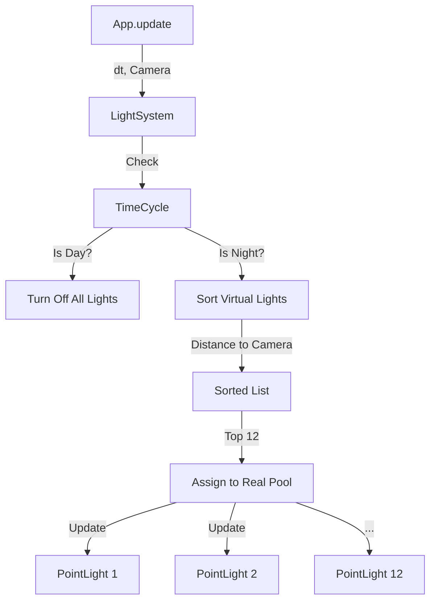

# Light System Documentation

## Overview

The Light System (`src/world/lightSystem.js`) is a rendering optimization module designed to render hundreds of localized light sources (street lamps, building windows, vehicle headlights) using a fixed, small pool of real GPU lights.

In standard forward rendering (Three.js default), performance degrades rapidly with the number of dynamic lights. The Light System solves this by decoupling "Virtual Lights" (logical sources) from "Real Lights" (THREE.PointLight objects).

## Architecture

The system maintains two lists:
1.  **Virtual Lights**: Lightweight objects defining position, color, and intensity. (Count: Unlimited)
2.  **Real Lights**: A fixed pool of `THREE.PointLight` objects added to the scene. (Count: 12)

Every frame, the system performs the following logic:



## Key Components

### 1. Virtual Light
A simple Javascript object stored in `this.virtualLights`.
```javascript
{
    pos: THREE.Vector3,        // World position
    color: THREE.Color,        // Light color
    intensity: Number,         // Base intensity
    range: Number,             // Point light distance
    parentMesh: THREE.Object3D // (Optional) Object to track
}
```

### 2. Real Light Pool
Initialized in the constructor, these are recycled every frame. They are never destroyed, only repositioned and recolored.

## Usage

### Initialization
The system is instantiated in `App.init` and requires access to the scene.

```javascript
this.lightSystem = new LightSystem(this.renderer.scene);
```

### Registering a Light
Entities should register their lights during their initialization (e.g., `postInit`).

#### Static Light (e.g., Street Lamp)
```javascript
// Register a fixed point
app.world.lightSystem.register(
    new THREE.Vector3(x, y, z),
    0xffaa00, // Color
    2.0,      // Intensity
    30        // Range
);
```

#### Dynamic Light (e.g., Moving Car)
To make a light follow an object, assign the mesh to `parentMesh`. The system will update the light's position from the mesh's `matrixWorld` every frame.

```javascript
const handle = app.world.lightSystem.register(
    new THREE.Vector3(), // Initial pos ignored if parentMesh set
    0xffffff,
    1.0
);
handle.parentMesh = myMovingMesh;
```

### Emissive Helpers
The helper method `createLightSource` automatically sets a mesh's material to emissive (unlit) and registers a virtual light at its location.

```javascript
// Makes the mesh glow and cast light
app.world.lightSystem.createLightSource(this.mesh, {
    color: 0xff0000,
    intensity: 5,
    range: 20
});
```

## Environment Integration

The system listens to `TimeCycle.sunIntensity` to automatically toggle lights.
*   **Day**: Lights are globally dimmed to 0.
*   **Night**: Lights fade in as `sunIntensity` drops below 0.5.
*   **Fog**: Real lights are affected by scene fog naturally via Three.js materials.

## Performance Considerations

*   **Max Lights**: Defaults to 12. Increasing this significantly impacts frame rate due to shader recompilation or complexity limits in forward rendering.
*   **Distance Checks**: The system uses squared distance comparisons to avoid expensive `Math.sqrt` calls during sorting.
*   **Updates**: Entities do not need to manually update their lights; the `LightSystem` handles all sorting and position tracking in its own `update()` loop.
