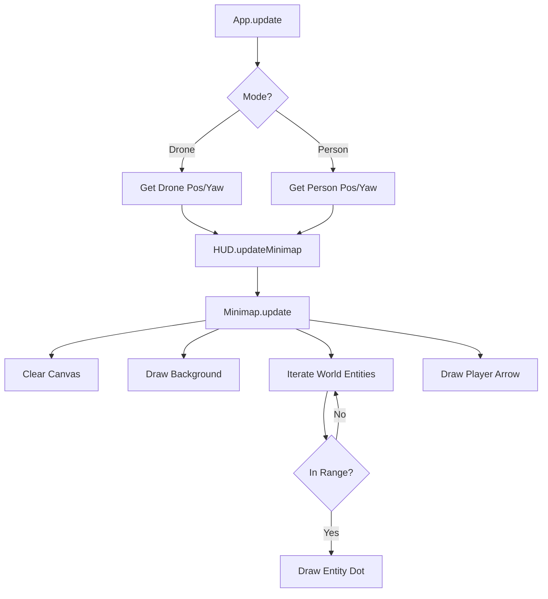

# Minimap Widget

## Overview
The **Minimap Widget** is a 2D HUD element that displays a top-down radar view of the drone's surroundings. It helps players navigate the city, locate objectives (rings), and identify infrastructure.

## Usage
The minimap is automatically visible in the bottom-right corner of the HUD during gameplay.

### Visual Key
- **Cyan Triangle**: Player (Drone/Person). Points in the direction of travel.
- **Green Dot**: Landing Pad (Recharge station).
- **Orange Dot**: Vehicles.
- **Blue Dot**: Rivers.
- **Grey Square**: Buildings.
- **Dark Grey Line**: Roads.

## Architecture

### `src/ui/widgets/minimap.js`
The core logic resides in the `Minimap` class. It uses a 2D `<canvas>` element to draw entities.

- **`update(playerPos, playerRotationY, entities)`**: Called every frame.
    - Clears the canvas.
    - Draws the radar background and grid rings.
    - Iterates through `entities` (provided by `World`).
    - Calculates relative position to the player.
    - Filters out entities outside the `range` (250m).
    - Draws shapes based on `entity.userData.type`.

### Integration
- **`src/ui/hud.js`**: Instantiates `Minimap` and appends it to the HUD container. Exposes `updateMinimap()` method.
- **`src/core/app.js`**: Calls `hud.updateMinimap()` at the end of the `update()` loop, passing the current player position and the list of world colliders.

## Customization
- **Range**: `this.range` (default 250m) controls the zoom level.
- **Size**: `this.size` (default 200px) controls the canvas resolution.

## Performance
- Uses 2D Canvas API which is performant for simple 2D shapes.
- Culling is performed by distance check (`dx*dx + dz*dz > range*range`) before drawing.
- **Optimization Note**: If the entity count grows > 1000, we may need to spatial partition the query or update the map at a lower frequency (e.g., every 5 frames).

## Visual Flow

