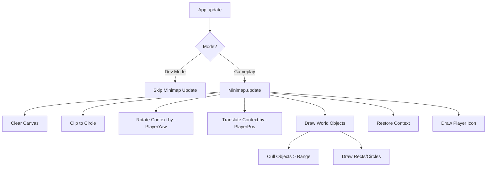

# Minimap
**Type:** UI Component
**Path:** `src/ui/minimap.js`

## Overview
The **Minimap** is a circular, rotating heads-up display element that provides the player with situational awareness. It renders a top-down view of the world, centered on the player (Drone or Person), showing static infrastructure, objectives (Rings), and landing pads.

## Usage
The Minimap is automatically instantiated by `App` and is visible during gameplay. It is hidden when **Dev Mode** is enabled or when the game is paused (via HUD visibility toggling).

### Visual Style
- **Shape:** Circular with clipping mask.
- **Orientation:** Rotating (Player always faces UP).
- **Colors:**
    - **Background:** Translucent Dark Teal (`rgba(0, 20, 30, 0.8)`).
    - **Roads:** Dark Grey.
    - **Buildings/Infrastructure:** Light Grey.
    - **Parks:** Green.
    - **Water:** Blue.
    - **Rings (Objectives):** Gold (`#FFD700`).
    - **Landing Pads:** Bright Green (`#00FF00`).
    - **Player:** Cyan Arrow.

## Implementation Details

### Rendering Loop
The `update(dt)` method uses the Canvas 2D API to redraw the map every frame (or could be throttled).

### Coordinate Transformation
To achieve the "Player facing Up" effect:
1.  **Translate** context to center of canvas `(100, 100)`.
2.  **Rotate** context by `player.yaw`. This rotates the world around the center.
3.  **Scale** context to zoom level.
4.  **Translate** context by `-player.position.x, -player.position.z` to move the world so the player is at the center.

## Integration
- **App.js**: Instantiates `Minimap` and calls `update(dt)`.
- **DevMode.js**: Toggles visibility via `setVisible(false/true)` when entering/exiting Dev Mode.
- **Style.css**: Defines `.minimap-container` positioning and canvas size.

## Performance Considerations
- **Culling**: Objects outside the `this.range` (default 300m) are skipped to avoid excessive `ctx.fillRect` calls.
- **Simplified Geometry**: Complex 3D meshes are represented by simple 2D primitives (Rectangles for buildings/roads, Circles for rings).
