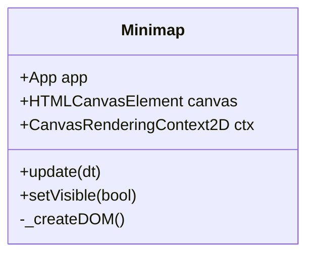

# Minimap

## Overview
The Minimap is a UI component that provides a top-down radar view of the surrounding environment. It displays the player's position at the center and nearby entities (buildings, roads, enemies, landing pads) as colored dots.

## Usage
The minimap is automatically instantiated by `App.js` and displayed in the bottom-right corner of the HUD.

- **Toggle Visibility:** Currently tied to HUD visibility (or manually via console `app.minimap.setVisible(false)`).
- **Player:** Represented by a cyan arrow pointing up (indicating forward direction).
- **Rotation:** The map rotates so that the player's forward direction is always up.

## Configuration
The `Minimap` class has the following properties that can be tweaked in code:

| Property | Default | Description |
| :--- | :--- | :--- |
| `range` | 150 | The radius in meters shown on the map. |
| `size` | 200 | The pixel width/height of the canvas. |

## Implementation Details

### Coordinate System
The minimap transforms 3D World coordinates to 2D Canvas coordinates using the following steps:
1. **Relative Position:** Calculate `dx, dz` between entity and player.
2. **Rotation:** Rotate the relative vector by `-playerYaw`. This ensures the player's "forward" is always aligned with the canvas "up" (-Y).
3. **Scaling:** Scale the rotated vector by `(canvasSize / 2) / range`.
4. **Centering:** Offset by `canvasSize / 2`.
5. **Clipping:** Entities outside the circular bounds are not drawn.

### Entity Colors
- **Landing Pad:** Green (Size 3)
- **Enemy:** Red (Size 3)
- **Building:** Blue/Purple (`#6666ff`)
- **Road/Sidewalk:** Dark Grey (`#444444`)
- **Default:** Light Grey (`#aaaaaa`)

### Class Structure

```mermaid
classDiagram
    class Minimap {
        +App app
        +HTMLCanvasElement canvas
        +CanvasRenderingContext2D ctx
        +update(dt)
        +setVisible(bool)
        -_createDOM()
    }
```
