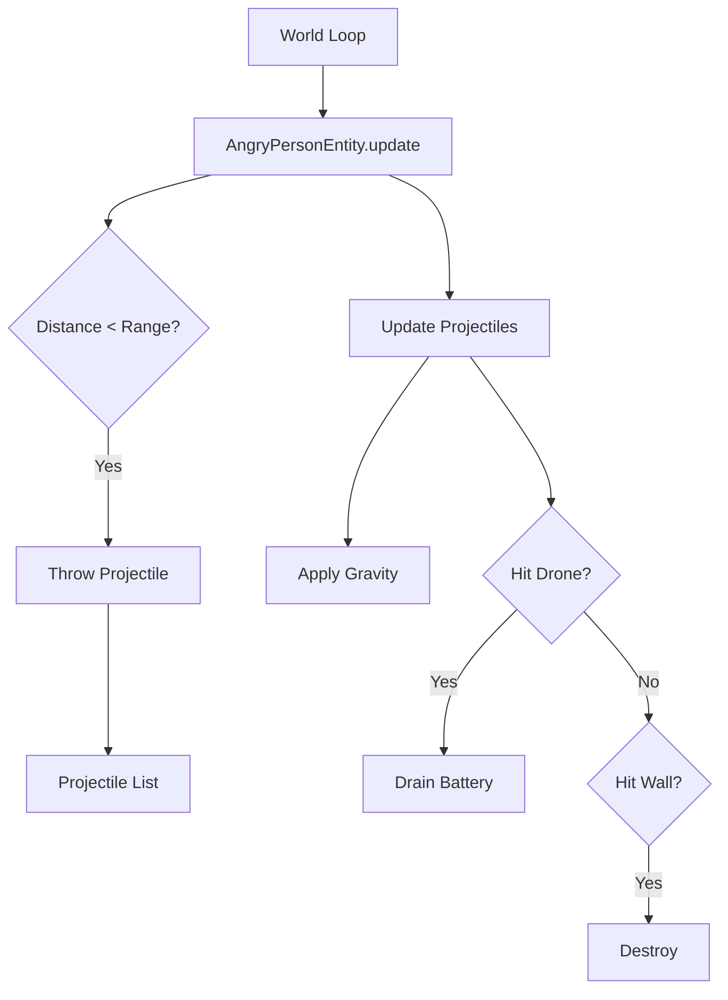

# NPC System

## Overview
The NPC (Non-Player Character) System manages active agents in the world that possess behavior logic, animation, and interactivity. Unlike static props or simple vehicles, NPCs can track the player (Drone), perform actions (throwing objects), and have distinct visual styles.

## Entities

### 1. Angry Person (`angryPerson`)
An aggressive NPC that throws projectiles at the Drone when it comes within range.

#### Behavior
*   **Idle**: Stands still.
*   **Tracking**: When the Drone is within `40` units, the NPC rotates to face it.
*   **Attack**: If the Drone is within `firingRange` (default 10m) and `cooldown` is complete, the NPC throws a projectile.
    *   **Projectiles**: Physical objects affected by gravity.
    *   **Impact**: Projectiles hitting the drone reduce battery by **10 units**.
    *   **Collision**: Projectiles are destroyed upon hitting the drone, ground, or other static objects.

#### Configuration (Params)
These parameters can be edited in Dev Mode:

| Parameter | Type | Default | Description |
| :--- | :--- | :--- | :--- |
| `appearance` | Number | Random | Index (0-7) for visual style (Business, Farmer, Goth, etc.). |
| `firingRange` | Number | 10 | Maximum distance (meters) to throw projectiles. |
| `throwInterval` | Number | 3.0 | Cooldown time (seconds) between throws. |

#### Visual Styles
The entity supports 8 distinct styles defined in `STYLES`:
*   **Classic**: Blue pants, Red shirt
*   **Business**: Grey suit, White shirt, Tie
*   **Worker**: Blue pants, Orange shirt, Hard hat
*   **Goth**: All black
*   **Summer**: Khaki, Cyan
*   **Farmer**: Overalls, Hat
*   **Sporty**: Tracksuit
*   **Doctor**: White pants, Scrubs

### 2. Construction Worker (`constructionWorker`)
A static ambient NPC that adds life to construction zones.

#### Behavior
*   **Animation**: The entire entity vibrates vertically using a high-frequency sine wave (`Math.sin(timer * 40)`) to simulate jackhammer operation.
*   **Particles**: Emits dust particles (`window.app.particles`) from the jackhammer tip roughly 3 times per second.

#### Configuration (Params)
| Parameter | Type | Default | Description |
| :--- | :--- | :--- | :--- |
| `state` | String | 'working' | Current state (currently only 'working' is implemented). |
| `vestColor` | Hex | 0xff6600 | Color of the safety vest (default Orange). |

### 3. Bird (`bird`)
See **[Bird System](./bird_system.md)** for detailed documentation on flocking and behaviors.

---

## Architecture

NPCs extend `BaseEntity` but implement complex `update(dt)` methods.

### Projectile Physics
Projectiles are managed locally within the entity instance (`this.projectiles`). They are **not** separate entities in the `EntityRegistry` to reduce overhead.
*   **Integration**: Simple Euler integration (`pos += vel * dt`).
*   **Collision**: Ray-sphere intersection against the Drone and `ColliderSystem`.

## Implementation Details

### Texture Generation
The `AngryPersonEntity` generates its face texture procedurally at runtime using the HTML5 Canvas API (`THREE.CanvasTexture`), drawing eyebrows, eyes, and a frown on the fly. This avoids external image dependencies.

### Performance
*   **Scratches**: Uses module-level temporary vectors (`_tempTargetPos`, `_tempDir`) to avoid garbage collection during the update loop.
*   **Cleanup**: Projectiles are automatically removed if they hit an object or exceed their lifetime (10s).
