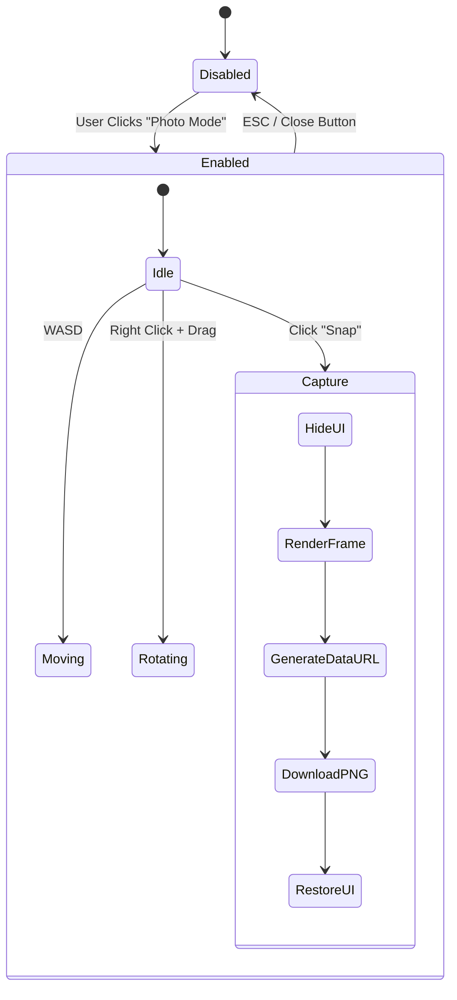

# Photo Mode Documentation

## Overview

The **Photo Mode** (`src/ui/photoMode.js`) is a dedicated gameplay state that allows users to detach the camera from the drone, navigate freely to compose shots, and capture high-resolution screenshots without UI overlays.

## Architecture

The system operates as an exclusive state machine layered on top of the main `App`. When enabled, it overrides the standard update loop and input handling.



## Functionality

### 1. State Management
*   **Enable**:
    *   Pauses the game loop (`app.paused = true`).
    *   Hides the HUD (`app.hud.setVisible(false)`).
    *   Hides the Pause Menu.
    *   Saves the current main camera state (Position, Rotation, FOV).
    *   Initializes the Photo Mode Camera at the current view, leveling the horizon (`roll = 0`).
*   **Disable**:
    *   Resumes the game loop.
    *   Restores the HUD.
    *   Restores the original camera FOV (Position/Rotation are naturally reset by the drone controller on the next frame).

### 2. Camera Controller
Unlike the drone or dev camera, the Photo Mode camera uses a "flying" control scheme optimized for composition:
*   **Pointer Lock**: Right-clicking locks the mouse pointer to the screen, allowing for infinite rotation (Look) without the cursor leaving the window.
*   **FOV Slider**: Modifies `camera.fov` (30° - 120°) in real-time for wide-angle or telephoto shots.

### 3. Image Capture
The capture process ensures a clean image:
1.  **Hide UI**: The Photo Mode controls are temporarily hidden via CSS.
2.  **Force Render**: calls `app.post.render(0)` to ensure the scene is drawn to the WebGL buffer without any HTML overlays.
3.  **Export**: Uses `renderer.domElement.toDataURL('image/png')` to extract the raw pixel data.
4.  **Download**: Dynamically creates an `<a>` tag to trigger a browser download named `drone-city-YYYY-MM-DD-HH-mm-ss.png`.

## Controls

| Key / Input | Action |
| :--- | :--- |
| **W, A, S, D** | Move Camera (Forward, Left, Back, Right) |
| **Q** | Ascend (Move Up) |
| **E** | Descend (Move Down) |
| **Shift** | Fast Movement (2.5x Speed) |
| **Right Click (Hold)** | Rotate Camera (Look) |
| **ESC** | Exit Photo Mode |

## Implementation Details

### Dependencies
*   **`src/core/app.js`**: Requires access to `renderer`, `post` (post-processing composer), and `hud`.
*   **DOM**: Injects its own UI into `#ui-layer` and attaches listeners to `document.body` for pointer lock.

### Pointer Lock Logic
The class manually handles `requestPointerLock()` and `exitPointerLock()` on `document.body` to support the "Hold Right Click to Look" interaction model, which differs from standard FPS controls (usually "Click to Lock").

```javascript
// src/ui/photoMode.js
window.addEventListener('mousedown', (e) => {
    if (e.button === 2) { // Right Click
        this.isRotating = true;
        document.body.requestPointerLock();
    }
});
```
