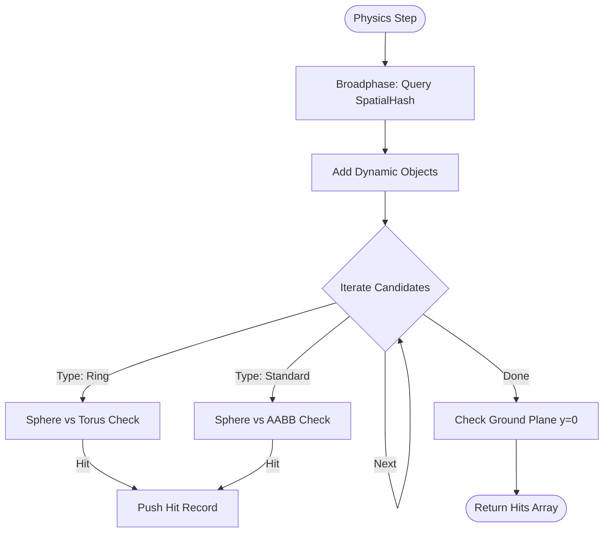

# Physics & Collision Architecture

## Overview
The project uses a custom kinematic physics engine rather than a general-purpose library (like Ammo.js or Cannon.js) to ensure precise, arcade-style handling for the drone and the on-foot player. The system handles static world geometry, dynamic objects (like cars), and gameplay triggers (Rings).

## Core Components

| Component | File | Responsibility |
|-----------|------|----------------|
| **ColliderSystem** | [`src/world/colliders.js`](../src/world/colliders.js) | Manages the list of collidable objects and executes the collision pipeline. |
| **SpatialHash** | [`src/utils/spatialHash.js`](../src/utils/spatialHash.js) | Optimizes broadphase lookups by partitioning the world into grid cells. |
| **CONFIG** | [`src/config.js`](../src/config.js) | Defines physical constants (Gravity, Drone/Person Radius, etc.) and Chunk Size. |

## Spatial Partitioning (SpatialHash)

To avoid checking the drone against every object in the world ($O(N)$), the world is divided into 2D grid cells (Buckets) based on X and Z coordinates.

- **Cell Size**: Defined by `CONFIG.WORLD.CHUNK_SIZE` (Default: 100m).
- **Key Generation**: A cell key is generated as `${floor(x/size)},${floor(z/size)}`.
- **Insertion**: Objects are inserted into *every* cell their Axis-Aligned Bounding Box (AABB) overlaps.

### Insertion Logic
```mermaid
flowchart LR
    Obj[Object AABB] --> Calc[Calculate Min/Max Cell Indices]
    Calc --> Loop{Iterate X, Z}
    Loop -->|Next Cell| Key[Generate Key "x,z"]
    Key --> Store[Push Object to Map[Key]]
    Store --> Loop
    Loop -->|Done| End[Finished]
```

## Collision Pipeline

The `ColliderSystem.checkCollisions()` method runs every frame during the physics step.



## Narrowphase Logic

### Standard Objects (Sphere vs AABB)
Most objects (Buildings, Trees) use a simplified Axis-Aligned Bounding Box (AABB).
1. **Closest Point**: The point inside the AABB closest to the sphere center is calculated by clamping the sphere center to the box min/max.
2. **Distance**: If `distance(center, closest) < radius`, a collision occurred.
3. **Normal**: Calculated as `normalize(center - closest)`.

### Gameplay Rings (Sphere vs Torus)
Rings require passing *through* the center, so a simple bounding box would block the hole. The system uses an analytical Sphere-vs-Torus approximation:
1. **Transform**: The drone's position is transformed into the Ring's local space.
2. **Project**: The 3D local position is projected onto the 2D plane of the torus (XY plane).
3. **Closest Circle Point**: The point on the ring's tube center-line (Major Radius $R=1.5$) closest to the projected point is found.
4. **Distance**: The distance from the local 3D position to this circle point is compared against the tube radius ($r=0.2$) + drone radius.

### Ground Plane
The world has an infinite floor at $y=0$. If `entity.y < radius`, a collision is registered with normal `(0, 1, 0)`.

## Dynamic Updates
Static objects (Buildings) are inserted once. Moving objects (Cars) or objects moved in **Dev Mode** must update their spatial hash entry.

- **Method**: `ColliderSystem.updateBody(mesh)`
- **Process**:
    1. Finds the wrapper for the mesh.
    2. Updates the AABB (`box.setFromObject`).
    3. Removes the old entry from `SpatialHash`.
    4. Re-inserts the object with the new AABB.
