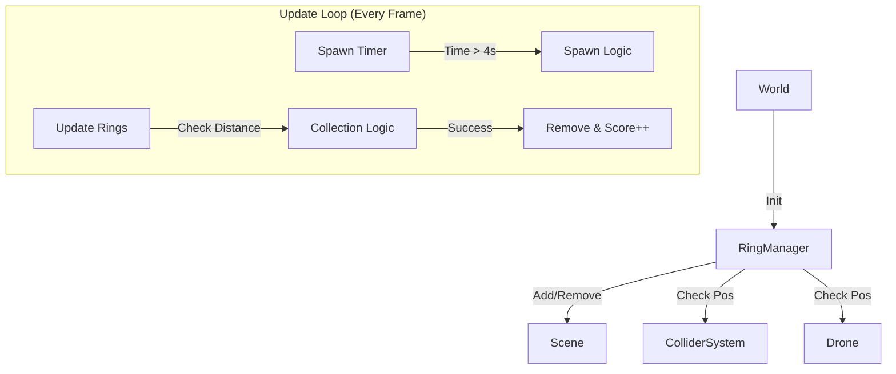

# Ring System Documentation

## Overview
The **Ring System** is the primary gameplay objective mechanic. It manages the spawning, lifecycle, and collection of floating gold rings. The system is designed to provide infinite gameplay by continuously spawning new rings as old ones are collected.

## Architecture
The system is encapsulated in the `RingManager` class (`src/gameplay/rings.js`). It operates as a self-contained manager that interfaces with the Scene (for rendering), the Drone (for collection checks), and the ColliderSystem (for valid spawn placement).

## Spawning Logic
The system attempts to maintain a steady flow of targets.

*   **Trigger**: A new ring is spawned every **4.0 seconds** (hardcoded `spawnInterval`), provided there are fewer than 9 rings in the world.
*   **Positioning**:
    *   **Range**: Random `(x, z)` within +/- 200 units (District bounds).
    *   **Altitude**: Random `y` between 5m and 40m.
    *   **Orientation**: Randomized Y-rotation (Yaw). The ring stands vertically (Rotation X = 0).
*   **Validation**:
    *   The system attempts to find a valid position up to **10 times**.
    *   It uses `ColliderSystem.checkCollisions(pos, ringRadius)` to ensure the ring does not clip through buildings or the ground.
    *   **Fallback**: If 10 attempts fail, it logs a warning and spawns at the last generated coordinate regardless of collisions.

## Collection Logic
Ring collection uses a custom geometric check rather than the global physics engine. This ensures precise "pass-through" detection suitable for a torus shape.

*   **Frequency**: Checked every frame in `update(dt)`.
*   **Algorithm**:
    1.  Transform the Drone's world position into the Ring's **Local Space** (inverse matrix).
    2.  Calculate:
        *   `distToCenter`: Distance from the local origin (0,0,0) in the XY plane.
        *   `distToPlane`: Absolute distance along the Z axis (thickness).
    3.  **Trigger Condition**:
        *   `distToCenter < 1.0` (Inside the hole, taking torus thickness into account).
        *   `distToPlane < 0.5` (Aligned with the ring's orientation).

> **Note**: This logic requires the drone to fly *through* the center. Hitting the rim (handled by physical colliders on static objects) is not applicable here as rings are trigger volumes, not physical obstacles.

## Persistence
The system supports map serialization, allowing rings to be saved and loaded with custom maps.
*   **Type**: `userData.type = 'ring'`
*   **Format**: JSON array of `{ position, rotation }`.
*   **Methods**: `exportRings()` and `loadRings()`.

## Dependencies
*   **Scene**: `THREE.Scene` for mesh management.
*   **Drone**: Reference to the player `Drone` instance for position tracking.
*   **ColliderSystem**: `src/world/colliders.js` for spawn validation.
