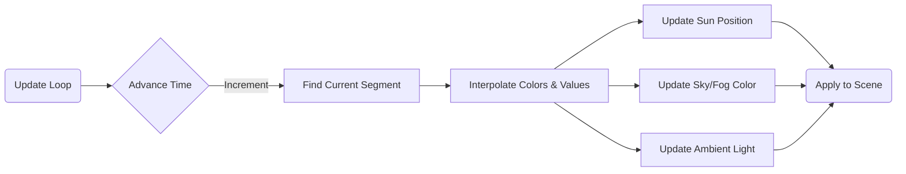

# Time Cycle & Environment

## Overview

The **Time Cycle System** (`src/world/timeCycle.js`) manages the dynamic day/night cycle, controlling the position of the sun and the color/intensity of all environmental lighting (Sky, Sun, Ambient, Fog). It allows for seamless transitions between dawn, day, dusk, and night.

## Architecture

The system uses a keyframe-based interpolation engine.



### Key Components

1.  **`TimeCycle` Class**:
    *   **State**: Tracks current `time` (0.0 - 24.0).
    *   **Speed**: Controls how fast time passes (Real-time vs. Accelerated).
    *   **Lock**: Can freeze time for specific lighting conditions (e.g., photography).

2.  **Environment Manager**:
    *   In `App.update()`, the calculated values from `TimeCycle` are applied to the Three.js `scene.background`, `scene.fog`, and global lights (`DirectionalLight`, `HemisphereLight`).

## Keyframe System

Lighting is defined by discrete keyframes at specific hours. The system interpolates (Linear Interpolation) between the two nearest keyframes based on the current time.

### Keyframe Data Structure
```javascript
{
    time: 8,              // Hour (0-24)
    sun: 0xffddaa,        // Sun Light Color (Hex)
    sky: 0x88ccff,        // Sky Background Color (Hex)
    ambient: 0x666666,    // Ambient Light Color (Hex)
    sunInt: 1.0,          // Sun Intensity (0.0 - 2.0)
    ambInt: 0.6           // Ambient Intensity (0.0 - 1.0)
}
```

### Cycle Stages

| Time | Stage | Characteristics |
|------|-------|-----------------|
| **00:00** | Midnight | Dark blue/black sky, minimal ambient light, no sun. |
| **05:00** | Dawn | Deep purple/orange horizon, low light. |
| **06:00** | Sunrise | Bright orange sun, rapidly increasing ambient light. |
| **12:00** | Noon | Peak brightness, blue sky, white sun overhead. |
| **18:00** | Sunset | Orange/Red lighting, long shadows. |
| **19:00** | Dusk | Fading light, transition to night colors. |

## Sun Orbit

The sun's position is calculated using simple trigonometry to simulate an orbit:
*   **Rise**: East (approx. 06:00)
*   **Set**: West (approx. 18:00)
*   **Zenith**: Directly overhead at 12:00 (+Y).
*   **Nadir**: Directly below at 00:00 (-Y).

```javascript
// Simplified Logic
const theta = (time / 24) * PI * 2 - (PI / 2);
x = cos(theta) * radius;
y = sin(theta) * radius;
```

## Configuration & Usage

### Runtime Control (Dev Mode)
The `TimeCycle` exposes properties that can be manipulated via the Dev Mode UI or World settings.

*   **`time`**: Set current hour directly (0-24).
*   **`speed`**: Multiplier for time passage (e.g., `60` = 1 game minute per real second).
*   **`isLocked`**: Boolean to pause the cycle.

### Integration
The `World` class initializes `TimeCycle` and ensures it is updated every frame.

```javascript
// src/world/world.js
this.timeCycle = new TimeCycle();

update(dt) {
    this.timeCycle.update(dt);
    // ... apply values to scene ...
}
```
