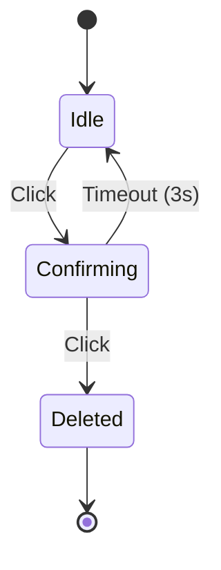

# Delete Confirmation Pattern

## UX Pattern
**Destructive Action with Double-Confirmation**

Instead of a blocking modal dialog or immediate deletion, the "Delete Selected" button transforms in-place to request confirmation. This "Double-Tap" pattern reduces friction for power users while preventing accidental data loss.

### Interaction Logic
1.  **Idle State**: Button displays "Delete Selected" (Dark Red).
2.  **First Click**:
    - Button text changes to "Confirm Delete?".
    - Color brightens to alert red.
    - A 3-second timer starts.
3.  **Second Click (within 3s)**: Action executes.
4.  **Timeout (after 3s)**: Button reverts to Idle State automatically.

## User Story
As a developer using the Inspector, I want to avoid accidentally deleting complex objects I've spent time configuring, but I also don't want to deal with annoying popup modals for every deletion.

## Accessibility
- **ARIA Live Region**: The button has `aria-live="polite"` so screen readers announce the text change to "Confirm Delete?".
- **Focus Management**: Focus remains on the button, allowing easy rapid activation via Space/Enter key (double press).
- **Color Contrast**: The confirmation state uses high-contrast red (`#d32f2f`) against white text.

## State Diagram

