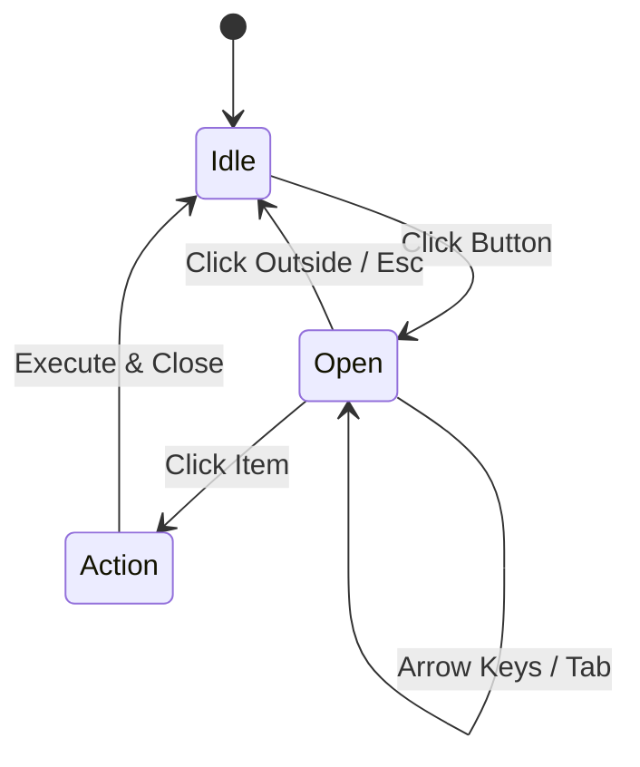

# Accessible Dev Mode Menu

## UX Pattern
The Dev Mode Menu has been enhanced to follow WAI-ARIA best practices for dropdown menus, replacing non-semantic `div` elements with interactive `<button>` elements.

### Interaction Logic
1.  **Idle State**:
    *   Top-level menu buttons (e.g., "Dev Mode", "Edit") display their label.
    *   `aria-haspopup="true"` and `aria-expanded="false"` are set.
    *   Dropdowns are hidden via `display: none` and have `aria-hidden="true"`.

2.  **Activation (Click)**:
    *   Clicking a menu button toggles the visibility of its associated dropdown.
    *   `aria-expanded` updates to `true` on the button.
    *   `aria-hidden` updates to `false` on the dropdown container.
    *   Focus is automatically moved to the first item in the dropdown for immediate keyboard accessibility.
    *   Clicking outside the menu or pressing `Escape` closes all open menus.

3.  **Navigation**:
    *   Dropdown items are native `<button>` elements with `role="menuitem"`.
    *   They support standard Tab navigation and focus states (blue background).
    *   **Arrow Keys**: `ArrowUp` and `ArrowDown` cycle focus through the menu items.
    *   **Home/End**: `Home` moves focus to the first item, `End` to the last.
    *   Clicking an item executes the action and closes the menu, returning focus to the parent menu button.

## Accessibility Features
*   **Semantic HTML**: Replaced `div`s with `<button>`s for menu items, ensuring they are naturally focusable and interactive.
*   **ARIA Roles**:
    *   Dropdown container: `role="menu"`
    *   Menu items: `role="menuitem"`
    *   Separators: `role="separator"`
*   **State Management**: `aria-expanded` and `aria-hidden` are dynamically updated to inform screen readers of the menu's state.
*   **Keyboard Support**:
    *   **Enter/Space**: Activates buttons.
    *   **Tab**: Moves focus between items.
    *   **ArrowUp/ArrowDown**: Cyclic navigation between menu items.
    *   **Home/End**: Jump to start/end of menu.
    *   **Escape**: Closes the menu and returns focus to the trigger button.

## Visuals
The menu retains the "Dark Mode" aesthetic of the Dev Tools but now includes clear focus indicators for accessibility.

