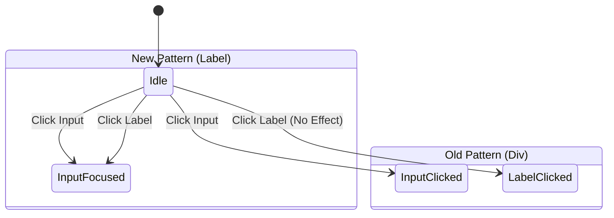

# Accessible Dev Mode Property Inputs

## UX Pattern
The Dev Mode Inspector panel generates input fields for entity properties dynamically. Previously, these were rendered as disconnected `<div>` labels and `<input>` fields.

The improved pattern uses semantic `<label>` elements explicitly associated with their inputs via unique `id` and `for` attributes.

## User Story
**As a** developer using a screen reader or keyboard navigation,
**I want** property labels to be programmatically associated with their input fields,
**So that** I know which property I am editing without having to guess based on visual proximity.

**As a** user with motor impairments (or just using a mouse),
**I want** to be able to click the text label of a property to focus the input,
**So that** the interactive target size is larger and easier to hit.

## Accessibility
- **Semantic Association:** Replaced `<div class="dev-prop-label">` with `<label class="dev-prop-label" for="unique-id">`.
- **Unique IDs:** Each generated input is assigned a unique ID (e.g., `dev-prop-input-42`) to ensure valid references.
- **Click Targets:** Clicking the label text now automatically focuses the input field.

## Visuals
There are no visual changes to the layout (CSS classes remain the same), but the interaction model is improved.

### State Diagram


## Code Comparison

### Before (Bad)
```javascript
const label = document.createElement('div');
label.textContent = 'Speed';
const input = document.createElement('input');
// No association
```

### After (Good)
```javascript
const id = `prop-${uniqueCounter++}`;
const label = document.createElement('label');
label.textContent = 'Speed';
label.htmlFor = id;

const input = document.createElement('input');
input.id = id;
// Semantic association established
```
