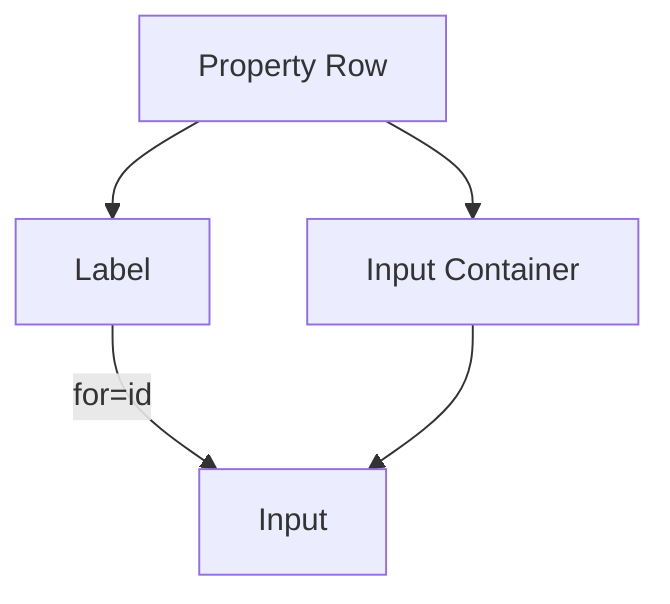

# Accessible Dev Mode Properties

## UX Pattern
The Dev Mode Property Inspector uses a semantic labeling strategy to ensure all inputs are accessible to screen readers and keyboard users.
- **Scalar Inputs:** Use explicit `<label for="id">` association.
- **Vector Inputs:** Use `aria-label` to describe the axis (e.g., "Position X") since they lack visible individual labels.
- **Checkboxes:** Use explicit label association for click targets.

## User Story
**As a** developer using assistive technology,
**I want** to know exactly which property axis I am editing,
**So that** I can precisely manipulate object transforms without guessing.

## Accessibility
- **ARIA Labels:** Added to X, Y, Z inputs in `_createVectorInput` and `_createScaleInput`.
  - Format: `[Label] [Axis]` (e.g., "Rotation Y").
- **Explicit Labels:** Converted `
` labels to `<label>` tags with `for` attributes matching input `id`s.
- **Unique IDs:** Generated unique IDs (`prop-num-1`, etc.) for every generated input to ensure valid associations.

## Visuals
The visual appearance remains identical (using existing CSS classes), but the underlying DOM structure is now semantic.

