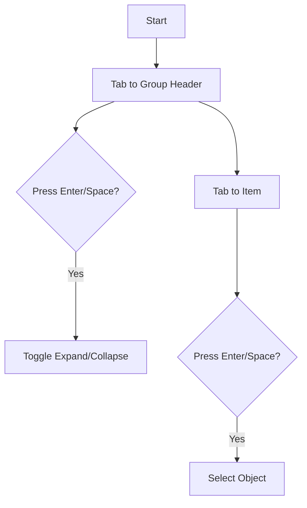

# UX Pattern: Keyboard-Accessible Outliner

## Pattern
The Outliner (Scene Graph) uses a standard tree/list interaction model where both group headers and individual items are keyboard-focusable and actionable.

## User Story
**As a** developer or user navigating with a keyboard,
**I want** to be able to browse the object hierarchy and select objects using the Tab, Enter, and Space keys,
**So that** I don't have to switch to the mouse constantly during detailed editing tasks.

## Interaction Logic
*   **Tab Order:** Group Headers and Object Items are included in the tab sequence (`tabindex="0"`).
*   **Action:** Pressing `Enter` or `Space` on a focused element triggers the same action as a click:
    *   **Group Header:** Toggles expansion/collapse.
    *   **Object Item:** Selects the object.

## Accessibility Implementation
*   **Roles:** Elements act as buttons (`role="button"`).
*   **Focus Management:** Standard browser focus outline is preserved for visibility.
*   **Event Handling:** `onkeydown` listeners intercept `Enter` and `Space` to trigger the click handler, preventing default scroll behavior where appropriate.

## Visuals
*   **Default:** Standard list items.
*   **Focus:** Browser default focus ring (typically blue outline).
*   **Selected:** Highlighted background (existing behavior).

