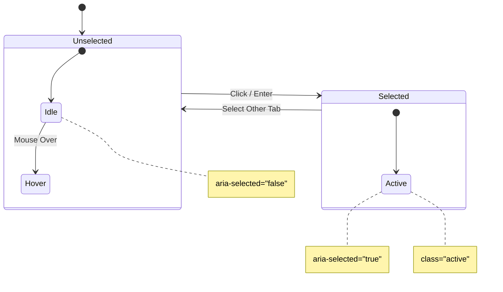

# Palette Category Tabs

## UX Pattern
**Accessible Tab Navigation**

The Palette component uses a tabbed interface to filter entity categories (Residential, Infrastructure, Vehicles, etc.).

- **Selected State:** The active tab is highlighted with a distinct background color and text weight.
- **Unselected State:** Tabs are muted but interactive.
- **Interaction:** Clicking a tab filters the grid of entities below it.

## User Story
**As a** level designer,
**I want** to quickly navigate between different categories of assets using keyboard or mouse,
**So that** I can find specific entities efficiently without searching through a massive list.

Previously, tabs were implemented as non-semantic `div` elements, making them inaccessible to keyboard users and screen readers.

## Accessibility
- **Element:** Uses semantic `<button>` elements with `role="tab"`.
- **Container:** The parent container has `role="tablist"` to group the tabs.
- **State:** The active tab has `aria-selected="true"`, while others have `aria-selected="false"`.
- **Keyboard:** Fully focusable via Tab, activatable via Enter/Space.
- **Visuals:** Uses the `asset-tab` and `asset-tabs` classes from the design system for consistent styling with the Asset Browser.

## State Diagram

