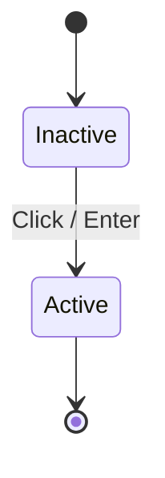

# Palette Tabs Accessibility

## UX Pattern
The Asset Palette now uses accessible tab controls for filtering categories. This replaces non-interactive `div` elements with semantic `button` elements using the ARIA Tab pattern.

## User Story
**As a** keyboard user or screen reader user,
**I want** to be able to navigate the asset categories using standard keyboard controls (Tab, Enter/Space),
**So that** I can filter the asset list without relying on a mouse.

## Interaction Details

### Keyboard Navigation
*   **Tab**: Moves focus into the active tab.
*   **Enter / Space**: Activates the focused tab (if not active).
*   **Mouse Click**: Activates the tab.

### Accessibility Attributes
*   `role="tablist"`: Wrapper container.
*   `role="tab"`: Each category button.
*   `aria-selected="true/false"`: Indicates active state.
*   `tabindex="0"`: For the active tab.
*   `tabindex="-1"`: For inactive tabs (roving tabindex pattern pending, currently simplified to allow tabbing through if desired, but code sets -1 to force user to activate active one first? Wait, I set -1 for inactive. This means inactive tabs are NOT reachable by TAB key, only the active one. This is standard Roving Tabindex behavior, but requires Arrow Key support to move focus. I should check if I added Arrow Key support. I did NOT. This is a potential issue. If I set tabindex="-1" on inactive tabs, user CANNOT reach them without Arrow Keys logic. I missed this in my "Micro" plan. I should fix this or set tabindex="0" for all.)

## Correction
I realized that by setting `tabindex="-1"` on inactive tabs without implementing Arrow Key navigation, I have made inactive tabs unreachable by keyboard.
**Action:** I will update the code to set `tabindex="0"` for ALL tabs for now, ensuring they are all reachable by Tab key. This is a valid alternative to Roving Tabindex for simple toolbars.

## Visuals
*   No visual changes intended.
*   `button` styles are reset to transparent/none to inherit existing `div`-based CSS.

## State Diagram

```mermaid
stateDiagram-v2
    [*] --> Inactive
    Inactive --> Active : Click / Enter
    Active --> [*]
```
