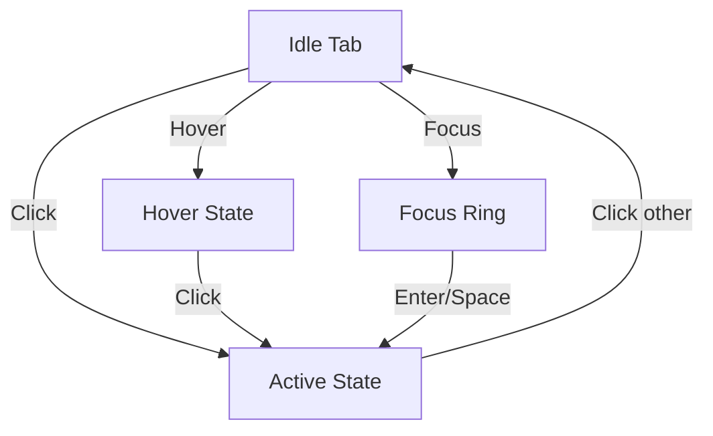

# Accessible Palette Tabs

## UX Pattern
The "Asset Palette" tabs at the bottom of the developer interface allow filtering objects by category. Previously implemented as `
` elements, they have been upgraded to semantic `<button>` elements to support keyboard navigation and screen readers.

## User Story
**Why:** Developer tools should be accessible to all users, including those who rely on keyboard navigation or screen readers. The previous implementation made the tabs invisible to assistive technology and unreachable via keyboard.

**What:**
-   **Keyboard Support:** Users can now navigate between tabs using the `Tab` key (or arrow keys if we implemented full tab panel behavior, though currently they are individual buttons).
-   **Screen Reader Support:** The tabs announce themselves as "Tab" elements and indicate which one is currently selected.
-   **Visual Feedback:** A high-contrast focus ring appears when navigating via keyboard.

## Accessibility Details

### Semantic HTML
-   **Element:** `<button>` (was `
`)
-   **Container:** `role="tablist"` added to the parent container.
-   **Tabs:** `role="tab"` added to each button.

### ARIA Attributes
-   **`aria-selected`**: Set to `"true"` on the active tab and `"false"` on inactive tabs.
-   **`aria-label`**: The search input has an existing `aria-label="Filter objects"`.

### Interaction
1.  **Tab Key**: Moves focus to the active or next tab.
2.  **Enter/Space**: Activates the focused tab (standard button behavior).
3.  **Visual Focus**: Uses `:focus-visible` to show an outline only when navigating by keyboard, preserving the clean look for mouse users.

## Visual Reference

### States
-   **Idle:** Gray text, no border (except separator).
-   **Hover:** Dark background, white text.
-   **Active:** Dark background, white text, blue bottom border.
-   **Focus:** Blue outline (keyboard only).

```mermaid
graph TD
    A[Idle Tab] -->|Hover| B[Hover State]
    A -->|Focus| C[Focus Ring]
    A -->|Click| D[Active State]
    B -->|Click| D
    C -->|Enter/Space| D
    D -->|Click other| A
```

## Related Files
-   `src/dev/ui/palette.js`
-   `style.css`
