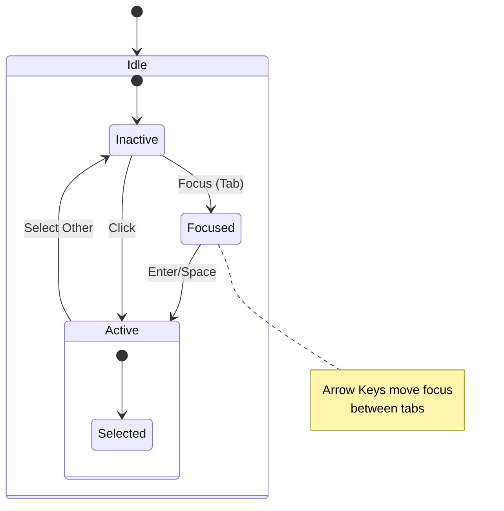

# Asset Palette Tabs

## UX Pattern
**Accessible Tabs**: A set of interactive category tabs that filter the asset list. Tabs are keyboard navigable and convey their state to assistive technologies.

## User Story
As a developer or content creator using the editor, I want to quickly switch between asset categories using the keyboard so that I can maintain my workflow without switching to the mouse.
As a user relying on screen readers, I need the category list to be identified as a tab list so I can understand the navigation structure and current selection.

## Interaction Design

### Keyboard Controls
- **Tab**: Moves focus into the active tab (or the first tab if none focused).
- **Arrow Right**: Moves focus to the next tab. Wraps to start.
- **Arrow Left**: Moves focus to the previous tab. Wraps to end.
- **Enter / Space**: Activates the focused tab, filtering the asset list.

### Focus Management
- When a tab is selected (via click or keyboard), it receives `tabindex="0"`.
- All other tabs receive `tabindex="-1"`.
- When the palette is refreshed (rebuilt), focus is programmatically restored to the active tab to prevent loss of context.

## Accessibility Implementation
**Code is Truth:** `src/dev/ui/palette.js`

- **Container**: `role="tablist"`, `aria-label="Asset Categories"`
- **Tabs**:
  - `role="tab"`
  - `aria-selected="true/false"`
  - `tabindex="0"` (active) / `"-1"` (inactive)

## State Diagram

```mermaid
stateDiagram-v2
    [*] --> Idle

    state Idle {
        [*] --> Inactive
        Inactive --> Focused : Focus (Tab)
        Focused --> Active : Enter/Space
    }

    state Active {
        [*] --> Selected
    }

    Inactive --> Active : Click
    Active --> Inactive : Select Other

    note right of Focused
        Arrow Keys move focus
        between tabs
    end note
```

## Visuals
The visual appearance remains consistent with the existing dark theme:
- **Inactive**: Gray text, transparent background.
- **Hover**: Lighter background.
- **Active**: White text, bottom blue border.
- **Focus**: Standard browser focus ring (or custom outline if implemented globally).
