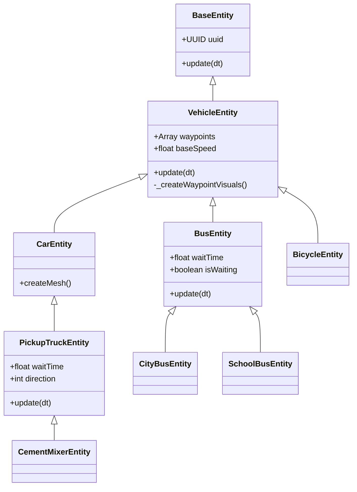

# Vehicle System Documentation

## Overview

The **Vehicle System** manages dynamic traffic entities within the world. Unlike static props, vehicles are active agents that follow defined paths, respect traffic rules (like waiting at stops), and provide life to the city environment.

## Architecture

The system extends the core `BaseEntity` with pathfinding and state management capabilities.



### Key Components

1.  **`VehicleEntity` (`src/world/entities/vehicles.js`)**: The abstract base class.
    *   **Pathing**: Moves the entity from its spawn point through a list of `waypoints` (Vector3 positions).
    *   **Looping**: By default, vehicles loop: Start -> Waypoint 1 -> ... -> Waypoint N -> Start.
    *   **Visuals**: Handles the generation of "Ghost" lines and spheres in Dev Mode for path editing.
    *   **Optimization**: Uses scratch vectors (`_targetPos`, `_localTarget`) to prevent Garbage Collection during per-frame updates.

2.  **`PickupTruckEntity` (Ping-Pong Logic)**:
    *   Instead of looping, these vehicles move from Start -> End, wait for `waitTime` seconds, and then reverse direction (End -> Start).
    *   Used for service vehicles like the **Cement Mixer**.

3.  **`BusEntity` (Stop Logic)**:
    *   Follows a standard loop but pauses at *every* waypoint for `waitTime` seconds.
    *   Ideal for simulating public transit routes with multiple stops.

## Configuration Parameters

Vehicles can be customized via the `params` object (passed during creation or edited in Dev Mode).

| Parameter | Type | Default | Description |
| :--- | :--- | :--- | :--- |
| `waypoints` | Array | `[]` | List of World Space `{x,y,z}` coordinates for the path. |
| `baseSpeed` | Number | ~10-18 | Movement speed (units/sec). Defined in class, derived from `CONFIG.DRONE.MAX_SPEED`. |
| `waitTime` | Number | 10 (Truck), 5 (Bus) | Time in seconds to pause at stops or path ends. |

## Movement Logic

### Waypoint Navigation
The vehicle treats its initial spawn position as "Point 0". The `waypoints` array contains "Point 1" through "Point N".

*   **Targeting**: The vehicle always looks at and moves towards the next target index.
*   **Coordinate Space**: Logic runs in Local Space relative to the parent `VehicleEntity` mesh. This allows the entire path to be rotated or moved by transforming the parent object.

### Collision & Physics
*   **Dynamic Update**: Vehicles update their physics bounding box (`box`) or `boundingSphere` every frame to match the visual mesh's position.
*   **Optimization**: The system prefers updating a `boundingSphere` (cheap matrix math) over a `Box3` (expensive 8-point transform) when possible.

## Developer Mode Integration

Vehicles are fully integrated with the built-in Level Editor.

### creating Paths
1.  **Select**: Click on a vehicle to select it.
2.  **Add Waypoint**: In the **Properties Panel**, click the **Add** button under the "Waypoints" section.
    *   A new white sphere appears (offset by 10 units).
3.  **Edit**:
    *   Select the white sphere (Waypoint) directly.
    *   Use the **Gizmo** (Translate/Move tool) to position it.
    *   The white path line updates in real-time.
4.  **Remove**: Select the vehicle and click **Remove Last** in the Properties Panel, or select a waypoint orb and press `Delete`.

### Debugging
*   **Visuals**: Path lines and waypoint orbs are only visible when **Dev Mode** is enabled (`Backtick` key).
*   **Console**: Warnings are logged if a vehicle has fewer than 2 points (Start + 1 Waypoint), in which case it will not move.

## Creating New Vehicles

To add a new vehicle type:
1.  Extend `VehicleEntity` (for looping) or `PickupTruckEntity` (for ping-pong).
2.  Implement `createMesh(params)` to return the visual model.
3.  Register with `EntityRegistry`.

```javascript
export class IceCreamTruckEntity extends PickupTruckEntity {
    constructor(params) {
        super(params);
        this.type = 'iceCreamTruck';
        this.baseSpeed = 12.0;
        this.waitTime = 15.0; // Stop longer to sell ice cream
    }
    // ... createMesh implementation ...
}
```
