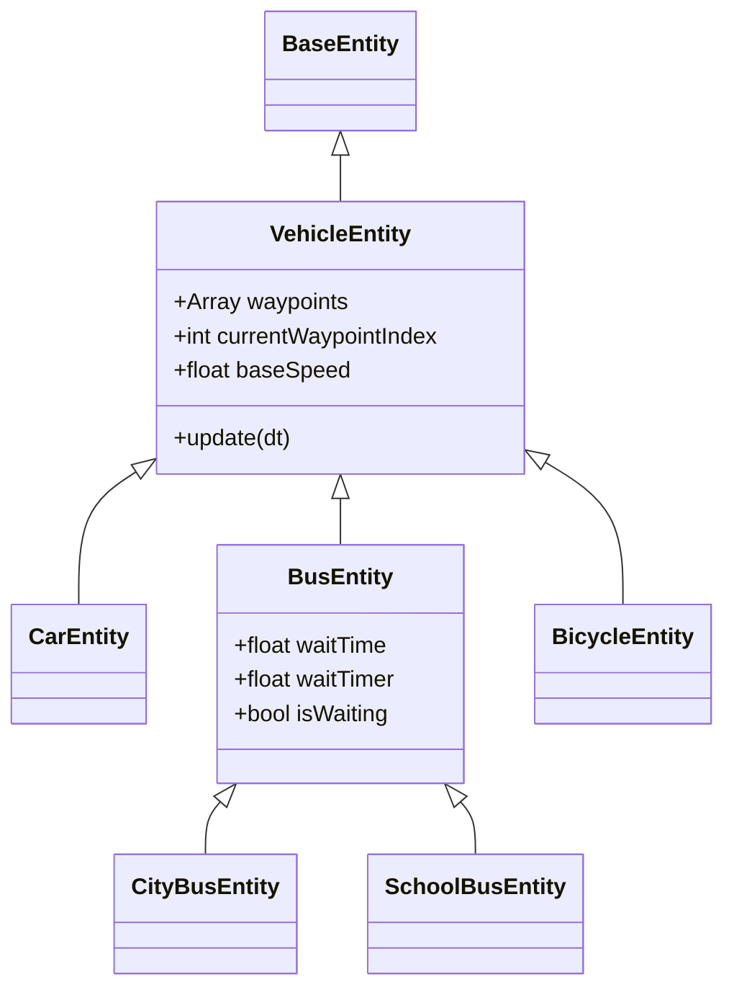
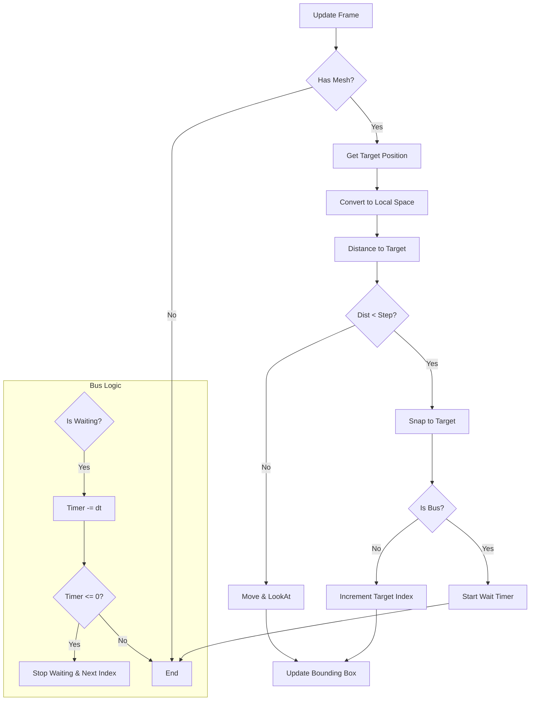

# Vehicle System

**Scope:** Gameplay / AI
**Primary Files:**
*   `src/world/entities/vehicles.js`
*   `src/world/entities/bus.js`
*   `src/dev/waypointManager.js`

## Overview

The Vehicle System manages the behavior of autonomous traffic agents (Cars, Buses, Trucks, Bicycles). Unlike complex flocking or pathfinding systems, vehicles in this project follow strict linear paths defined by **Waypoints**. This ensures predictable traffic flow and low CPU overhead.

## Architecture

### Class Hierarchy

### Movement Logic

Vehicles move by linearly interpolating their position towards the next waypoint in their list.

1.  **State**: The vehicle stores its path as an array of `THREE.Vector3` points in `this.waypoints`.
2.  **Targeting**: It tracks `mesh.userData.targetIndex` to know which point it is driving towards.
3.  **Local Space Movement**:
    *   The root `mesh` (Entity) acts as the "Anchor" or "Spawn Point" and generally does not move after initialization.
    *   The `modelGroup` (Child of `mesh`) is the actual moving part. It moves in local space relative to the anchor.
    *   This design simplifies serialization: The "Entity" is just a point with a list of offsets (waypoints).

### The Update Loop

## Waypoints

Waypoints are stored in the `waypoints` array.
*   **Index 0**: The vehicle's spawn position.
*   **Index 1..N**: Subsequent points.
*   **Looping**: When the vehicle reaches the last waypoint, it targets Index 0 (Spawn Point) again, creating a closed loop.

### Editing (Dev Mode)

The `WaypointManager` (`src/dev/waypointManager.js`) provides tools to edit paths visually.

*   **Select**: Click on a vehicle or a white Waypoint orb.
*   **Add**: Adds a new waypoint 10 units forward from the currently selected point.
*   **Remove**: Removes the last waypoint (or selected ones).
*   **Visuals**:
    *   **Orbs**: White spheres indicate waypoint positions.
    *   **Lines**: White lines show the path.
    *   Visuals are only visible when Dev Mode is active.

## Specialized Behaviors

### Stop-and-Go (`BusEntity`)

Buses (`CityBusEntity`, `SchoolBusEntity`) and Pickup Trucks implement a waiting mechanism.
*   **Parameter**: `waitTime` (seconds).
*   **Behavior**: When a bus reaches a waypoint, it pauses for `waitTime` seconds before proceeding to the next one.
*   **Usage**: Simulates bus stops or delivery drop-offs.

## Performance

*   **Scratch Vectors**: The `update` loop uses module-level temporary vectors (`_targetPos`, `_dir`) to avoid Garbage Collection spikes.
*   **Bounding Volumes**: `postInit` pre-calculates the local AABB of the car model to avoid re-computing it every frame. Dynamic updates just transform this cached box.
