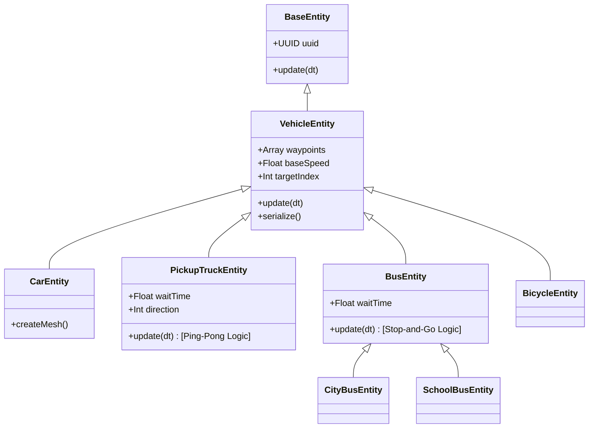

# Vehicle System Documentation

## Overview

The **Vehicle System** manages autonomous AI traffic within the game world. Unlike static entities, vehicles possess dynamic movement logic, navigation capabilities via waypoints, and specialized behaviors (like waiting at bus stops).

## Architecture

The system is built upon the standard [Entity System](./entity_system.md), extending `BaseEntity` with navigation logic.

### Key Components

1.  **`VehicleEntity` (`src/world/entities/vehicles.js`)**: The abstract base class.
    *   **Responsibility**: Handles basic point-to-point movement, rotation (looking at target), and waypoint indexing.
    *   **Data**: Stores `waypoints` (Array of Vector3) in `userData`.
    *   **Optimization**: Uses a cached `_localBox` and `boundingSphere` to update collision volumes without recalculating geometry every frame.

2.  **`WaypointManager` (`src/dev/waypointManager.js`)**: A Developer Mode tool.
    *   **Responsibility**: Visualizes vehicle paths (lines and orbs) and handles user input for adding/removing waypoints.
    *   **Integration**: Modifies the `userData.waypoints` array of selected vehicles directly.

## Movement Logic

Vehicles support different traversal patterns defined by their subclasses:

### 1. Standard Loop (`CarEntity`, `BicycleEntity`)
*   **Behavior**: Moves from Start -> Waypoint 1 -> ... -> Waypoint N -> Start.
*   **Looping**: Upon reaching the last waypoint, it immediately targets the starting position (Spawn Point), creating a closed loop.
*   **Use Case**: General traffic, circling a block.

### 2. Ping-Pong (`PickupTruckEntity`)
*   **Behavior**: Moves from Start -> End -> Start.
*   **Reversal**: When reaching the last waypoint, it flips its `direction` and traverses the path backwards.
*   **Wait Time**: Can pause for `waitTime` seconds at both ends of the path before reversing.
*   **Use Case**: Delivery vehicles, patrol routes.

### 3. Stop-and-Go (`BusEntity`)
*   **Behavior**: Similar to the Standard Loop but pauses at *every* waypoint.
*   **Logic**: When reaching a waypoint, it enters a `isWaiting` state for `waitTime` seconds before proceeding to the next target.
*   **Use Case**: Public transit (City Bus, School Bus) simulating passenger pickup.

## Developer Mode Workflow

Vehicles are fully integrated into the Dev Mode editor.

### Creating a Path
1.  **Spawn**: Drag a vehicle (e.g., "Car") from the Palette into the world.
2.  **Select**: Click the vehicle. You will see a "Path Line" (white) connecting the vehicle to its target.
3.  **Add Waypoint**:
    *   In the **Inspector** panel, click "Add Waypoint".
    *   A new white orb appears 10 units away.
    *   Select and Drag the orb to position it.
4.  **Extend**: Select the *last* orb and click "Add Waypoint" again to extend the path.

### Editing
*   **Move**: Dragging any waypoint orb updates the path in real-time.
*   **Insert**: Selecting a mid-path orb and clicking "Add Waypoint" inserts a new point *after* the selection.
*   **Delete**: Select a waypoint orb and press `Delete` (or use the Inspector button) to remove it.

## Configuration

Vehicle behavior is controlled via `userData.params`, editable in the Inspector.

| Parameter | Type | Default | Description |
| :--- | :--- | :--- | :--- |
| `waypoints` | Array | `[]` | List of world-space coordinates (Vector3). |
| `speed` | Number | ~18.0 | *Internal*: Base speed derived from `CONFIG.DRONE.MAX_SPEED`. |
| `waitTime` | Number | 5-10 | **(Bus/Truck only)** Time in seconds to wait at stops or endpoints. |

## Implementation Details

### Performance
*   **Memory**: Vehicles use scratch vectors (`_targetPos`, `_dir`) to avoid Garbage Collection during the update loop.
*   **Physics**: Collision bodies use `boundingSphere` where possible for faster checks (`Sphere.applyMatrix4` is cheaper than `Box3.applyMatrix4`).
*   **Rendering**: Geometries are merged (Body + Details) to minimize draw calls per vehicle.

### Serialization
When saving a map, the `serialize()` method ensures `userData.waypoints` and `waitTime` are preserved in the JSON output, allowing complex traffic patterns to be restored upon load.
