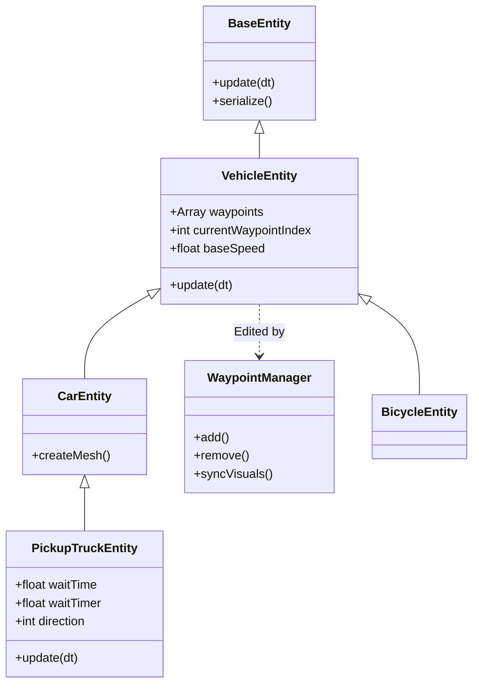

# Vehicle System

**Scope:** Gameplay, AI, Physics
**Files:** `src/world/entities/vehicles.js`, `src/dev/waypointManager.js`, `src/world/carGeometries.js`

## Overview

The Vehicle System manages all autonomous traffic in the world. It supports cars, trucks, and bicycles that follow defined paths (waypoints), handle basic physics integration, and can be edited directly in Developer Mode.

## Architecture

The system is built on `VehicleEntity`, a specialized subclass of `BaseEntity`. It integrates with the `WaypointManager` for visual editing and uses a "Zero Allocation" update loop for high performance.


```mermaid
classDiagram
    class BaseEntity {
        +update(dt)
        +serialize()
    }

    class VehicleEntity {
        +Array waypoints
        +int currentWaypointIndex
        +float baseSpeed
        +update(dt)
    }

    class CarEntity {
        +createMesh()
    }

    class PickupTruckEntity {
        +float waitTime
        +float waitTimer
        +int direction
        +update(dt)
    }

    class WaypointManager {
        +add()
        +remove()
        +syncVisuals()
    }

    BaseEntity <|-- VehicleEntity
    VehicleEntity <|-- CarEntity
    VehicleEntity <|-- BicycleEntity
    CarEntity <|-- PickupTruckEntity

    VehicleEntity ..> WaypointManager : Edited by
```

## Vehicle Types

### 1. Car (`CarEntity`)
*   **Visuals**: Standard Sedan geometry.
*   **Behavior**: Continuous loop movement through waypoints.
*   **Speed**: Defined by `CONFIG.DRONE.MAX_SPEED` (approx 17.5 units/sec).

### 2. Pickup Truck (`PickupTruckEntity`)
*   **Visuals**: Truck chassis with a cargo bed.
*   **Behavior**: "Ping-Pong" movement.
    *   Moves from Start -> End.
    *   Waits for `waitTime` (default 10s).
    *   Reverses direction: End -> Start.
    *   Waits again, then repeats.
*   **Usage**: Ideal for delivery vehicles or industrial traffic.

### 3. Bicycle (`BicycleEntity`)
*   **Visuals**: Detailed bicycle frame with a rider mesh.
*   **Behavior**: Slower speed (50% of cars).

## Movement Logic

Vehicles move linearly between 3D points in space.

1.  **Waypoints**: An array of `THREE.Vector3` stored in `userData.waypoints`.
2.  **Target Index**: The vehicle always moves towards `waypoints[targetIndex - 1]`. (Index 0 is the start position).
3.  **Update Loop**:
    *   Calculate distance to target.
    *   Move `speed * dt` towards target.
    *   **Arrival**: If distance < step size, snap to target and increment index.
    *   **Looping**: If at end, reset index to 0 (or reverse for Pickup).

### Optimization (Zero Allocation)
To prevent Garbage Collection stutters, the `update(dt)` method reuses module-level "scratch vectors" instead of creating new `Vector3` objects every frame.

```javascript
// src/world/entities/vehicles.js
const _targetPos = new THREE.Vector3();
const _localTarget = new THREE.Vector3();
const _currentLocal = new THREE.Vector3();
const _dir = new THREE.Vector3();
```

## Developer Mode Integration

The **Waypoint System** allows level designers to draw traffic paths visually.

### Creating a Path
1.  **Select** a vehicle in the world.
2.  Open the **Properties** tab in the Inspector.
3.  Click **Add** under the "Waypoints" section.
    *   This calls `WaypointManager.add()`.
    *   A new waypoint (Sphere) appears 10 units ahead of the last point.
4.  **Move** the waypoint sphere using the Gizmo to define the curve.

### Editing
*   **Select Waypoint**: Clicking a white sphere selects it.
*   **Modify**: Move it with the Transform Gizmo. The line visual updates in real-time.
*   **Insert**: With a waypoint selected, clicking "Add" inserts a new point *after* the selection.
*   **Delete**: Select a waypoint and press `Delete`, or use "Remove Last" on the vehicle.

### Visualization
*   **Line**: A white line connects the vehicle to all waypoints in order.
*   **Orbs**: White spheres indicate nodes.
*   **Visibility**: These helpers are contained in a `waypointGroup` that is only visible when Dev Mode is active.

## Physics & Collision

Vehicles are physical objects that block the player and drones.

*   **Bounding Sphere**: The system prioritizes a `THREE.Sphere` for collision checks, which is cheaper to transform (`O(1)`) than an AABB Box (`O(8)`).
*   **Local Box**: A pre-calculated `_localBox` is cached during `postInit`.
*   **Dynamic Update**: In every frame, if `modelGroup` moves, the global bounding volume is updated.

## Geometry Generation

Vehicle meshes are procedurally generated in `src/world/carGeometries.js` using `THREE.BoxGeometry` and `THREE.CylinderGeometry`.
*   **Batching**: Geometries are merged (`BufferGeometryUtils.mergeGeometries`) into two groups: `body` (painted) and `details` (tires, windows, bumpers).
*   **Materials**: Shared standard materials are used to allow GPU instancing if needed in the future (though currently vehicles are individual entities).
