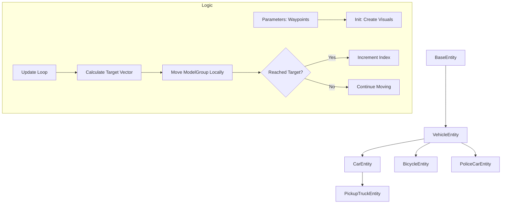

# Traffic & Vehicle System

## Overview
The **Traffic & Vehicle System** manages dynamic transportation entities that navigate the city using a waypoint-based pathfinding system. It includes various vehicle types (Cars, Trucks, Bicycles) and the Traffic Lights that regulate intersections.

## Architecture

The system is built on `VehicleEntity`, which extends `BaseEntity`. Instead of complex physics-based driving, vehicles use a kinematic **Waypoint System** to move smoothly between defined points.

```mermaid
graph TD
    Base[BaseEntity] --> Vehicle[VehicleEntity]
    Vehicle --> Car[CarEntity]
    Vehicle --> Bike[BicycleEntity]
    Vehicle --> Police[PoliceCarEntity]
    Car --> Pickup[PickupTruckEntity]

    subgraph Logic
        Params[Parameters: Waypoints] --> Init[Init: Create Visuals]
        Update[Update Loop] --> Calc[Calculate Target Vector]
        Calc --> Move[Move ModelGroup Locally]
        Move --> Check{Reached Target?}
        Check -- Yes --> Next[Increment Index]
        Check -- No --> Continue[Continue Moving]
    end
```

### Core Components

1.  **VehicleEntity** (`src/world/entities/vehicles.js`):
    *   **Movement**: Moves a child `modelGroup` relative to the entity's root position. The root position is the start point (Index 0).
    *   **Waypoints**: An array of `THREE.Vector3` points defining the path.
    *   **Visuals**: Debug spheres (`waypointGroup`) can be toggled to visualize the path in the editor.
    *   **Performance**: Uses scratch vectors (`_targetPos`, `_localTarget`) to avoid garbage collection during the update loop.

2.  **TrafficLightEntity** (`src/world/entities/trafficLight.js`):
    *   **State Machine**: Cycles through Red, Green, and Yellow phases.
    *   **Visuals**: Updates `emissiveIntensity` of the lamp materials to simulate glowing lights.

---

## Vehicles

### 1. VehicleEntity (Base)
The abstract base class for all moving vehicles.

*   **Logic**:
    *   The Entity's main `mesh` is placed at the **Start Point**.
    *   The visible car model (`modelGroup`) moves *inside* the main mesh's coordinate space.
    *   **Why?** This allows the underlying `BaseEntity` logic (serialization, selection) to remain simple, while the visual car travels arbitrarily far along its path.
*   **Collision**:
    *   **Optimization**: Instead of recalculating the AABB of the complex car mesh every frame, it pre-calculates a `_localBox` and `_localSphere` in `postInit`.
    *   During `update()`, it simply applies the current translation matrix to this local shape, significantly reducing CPU overhead.

### 2. Standard Vehicles
*   **CarEntity**: A standard sedan. Red body, dark grey details.
    *   *Speed*: Slightly slower than Drone Max Speed.
*   **BicycleEntity**: A composite mesh of cylinders and toruses.
    *   *Speed*: 50% of Drone Max Speed.

### 3. PickupTruckEntity
A specialized subclass that implements "Ping-Pong" movement with wait times.

*   **Behavior**:
    *   Moves from Start -> End.
    *   **Waits** for `waitTime` seconds.
    *   Reverses direction (End -> Start).
    *   Waits again, then repeats.
*   **Parameters**:
    *   `waitTime` (Default: 10s): Time to idle at each end of the path.

### 4. PoliceCarEntity
Extends `VehicleEntity` with visual flair.

*   **Visuals**:
    *   White body with "POLICE" side stripes.
    *   **Light Bar**: Red and Blue lights on the roof.
*   **Logic**:
    *   Implements a flash timer (0.4s interval).
    *   Alternates the `emissiveIntensity` of the red and blue materials to simulate strobing lights.
    *   *Speed*: Faster than standard cars (+2.0 units).

---

## Traffic Lights

**Source:** `src/world/entities/trafficLight.js`

Traffic lights are static entities that cycle through colors. Currently, they are visual-only and do not physically stop vehicle entities (who follow strict waypoint paths), but they add life to intersections.

### Phases
| Phase | Duration | Active Light |
| :--- | :--- | :--- |
| **Green** | 4.2s | Bottom (Green) |
| **Yellow** | 1.2s | Middle (Yellow) |
| **Red** | 4.2s | Top (Red) |

### Implementation
*   **Lazy Update**: The `update(dt)` loop interpolates `emissiveIntensity` towards a target value (2.2 for active, 0.25 for inactive).
*   **Randomization**: Each traffic light starts with a random time offset (`Math.random() * 2`) so they don't all blink in perfect unison across the city.

---

## Usage (Adding a Vehicle)

Vehicles are typically placed via the **Dev Mode** or **Map Loader**.

1.  **Create**: `EntityRegistry.create('pickupTruck', { x: 0, y: 0, z: 0 })`.
2.  **Define Path**:
    *   Set `waypoints` in params: `[{ x: 10, y: 0, z: 0 }, { x: 20, y: 0, z: 10 }]`.
    *   In Dev Mode, this is handled by the "Path Tool" (if available) or manual property editing.

## Performance Considerations

*   **Zero Allocation**: Vehicle updates use shared module-level `Vector3` instances (`_targetPos`, `_dir`) to prevent memory churn.
*   **Bounding Sphere**: Collision checks prioritize the `boundingSphere` (cheap transform) over the `box` (expensive 8-point transform).
