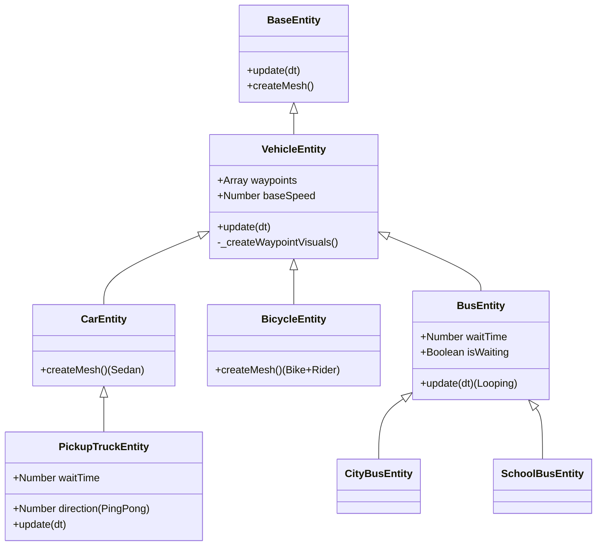

# Vehicle System Documentation

## Overview

The **Vehicle System** manages the autonomous traffic simulation in the game world. It handles the movement, navigation, and behaviors of dynamic vehicles such as cars, trucks, buses, and bicycles.

Unlike simple static animations, vehicles are fully realized entities that:
*   Navigate between 3D waypoints.
*   Respect traffic logic (e.g., stopping at designated points).
*   Support different movement patterns (Looping vs. Ping-Pong).
*   Utilize performance-optimized update loops for high-density traffic.

## Architecture

The system uses an inheritance hierarchy grounded in `BaseEntity` but specialized for path following.


```mermaid
classDiagram
    class BaseEntity {
        +update(dt)
        +createMesh()
    }

    class VehicleEntity {
        +Array waypoints
        +Number baseSpeed
        +update(dt)
        -_createWaypointVisuals()
    }

    class CarEntity {
        +createMesh() (Sedan)
    }

    class PickupTruckEntity {
        +Number waitTime
        +Number direction (PingPong)
        +update(dt)
    }

    class BicycleEntity {
        +createMesh() (Bike+Rider)
    }

    class BusEntity {
        +Number waitTime
        +Boolean isWaiting
        +update(dt) (Looping)
    }

    class CityBusEntity
    class SchoolBusEntity

    BaseEntity <|-- VehicleEntity
    VehicleEntity <|-- CarEntity
    CarEntity <|-- PickupTruckEntity
    VehicleEntity <|-- BicycleEntity
    VehicleEntity <|-- BusEntity
    BusEntity <|-- CityBusEntity
    BusEntity <|-- SchoolBusEntity
```

### Core Classes

1.  **`VehicleEntity` (`src/world/entities/vehicles.js`)**: The abstract base class for all traffic.
    *   **Responsibilities**: Handles linear interpolation between waypoints, rotation alignment (`lookAt`), and waypoint visualization in Dev Mode.
    *   **Optimization**: Uses "Zero Allocation" patterns (scratch vectors) to prevent Garbage Collection spikes during frame updates.

2.  **`CarEntity` / `BicycleEntity`**: Standard implementations that define specific meshes (Sedan, Bike) and speeds.

3.  **`PickupTruckEntity`**: Extends `CarEntity` to add **Ping-Pong** movement (reverses direction at the end of the path) and stop-and-go behavior.

4.  **`BusEntity` (`src/world/entities/bus.js`)**: Specialized for public transport.
    *   **Behavior**: Implements **Looping** movement (returns to the first waypoint after the last) and waits for a configurable duration at every stop.

## Features & Behaviors

### 1. Waypoint Navigation
Vehicles move along a path defined by a set of points.
*   **Source**: Waypoints are passed in the `params.waypoints` array during instantiation.
*   **Runtime**: The entity tracks `userData.targetIndex` to know which point it is moving towards.
*   **Visuals**: In Developer Mode, vehicles render a line and spheres showing their path.

### 2. Movement Patterns

| Class | Pattern | Description |
| :--- | :--- | :--- |
| `VehicleEntity` / `Car` | **Loop** | Standard implementation usually loops, but defaults depend on subclass logic. |
| `PickupTruckEntity` | **Ping-Pong** | Moves A -> B -> C -> B -> A. Reverses `direction` when reaching the end. |
| `BusEntity` | **Loop** | Moves A -> B -> C -> A. Teleports/Drives back to start after the last point. |

### 3. Stop-and-Go Logic
Certain vehicles can pause at waypoints to simulate picking up passengers or delivery.
*   **Config**: `waitTime` (seconds).
*   **Implementation**: `BusEntity` and `PickupTruckEntity` override `update(dt)` to decrement a `waitTimer` before advancing to the next target.

## Configuration

When creating a vehicle via `EntityRegistry` or `ObjectFactory`, you can configure:

```javascript
EntityRegistry.create('cityBus', {
    x: 0, y: 0, z: 0, // Initial Spawn Point (Start of path)
    waypoints: [
        { x: 100, y: 0, z: 0 },
        { x: 100, y: 0, z: 100 },
        { x: 0, y: 0, z: 100 }
    ],
    waitTime: 5, // Seconds to wait at each stop (Bus/Truck only)
    speed: 15 // Optional override (if supported by specific class logic)
});
```

## Performance Note

The `update(dt)` method in `VehicleEntity` is hot code (runs every frame for every car). To maintain 60 FPS with hundreds of vehicles:
1.  **Scratch Vectors**: It uses module-level `THREE.Vector3` instances (`_targetPos`, `_dir`) instead of creating new ones.
2.  **Squared Distance**: Checks `distanceToSquared` where possible to avoid `Math.sqrt`.
3.  **Bounding Volumes**: Updates a `BoundingSphere` for collision checks instead of a more expensive `Box3` where applicable.
