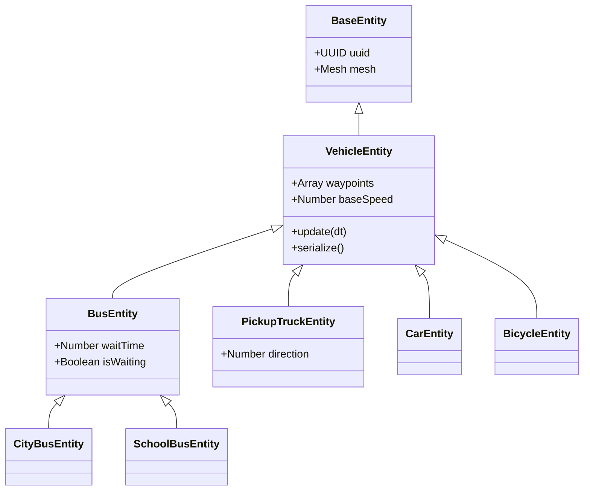
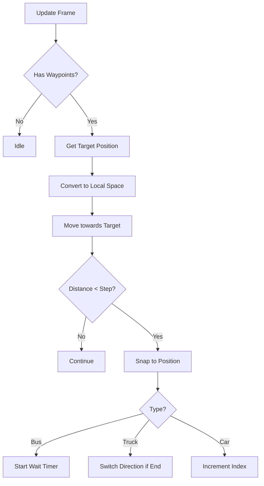

# Vehicle System

## Overview

The **Vehicle System** manages autonomous traffic entities that navigate the world along predefined paths. Unlike simple physics objects, vehicles follow a sequence of 3D waypoints, managing their own speed, rotation, and idle behaviors.

## Architecture

Vehicles extend the `BaseEntity` class but implement a custom movement controller in their `update(dt)` loop.

### Key Components

*   **`VehicleEntity` (`src/world/entities/vehicles.js`)**: The core controller. Handles path interpolation, rotation (looking at target), and basic looping behavior.
*   **`WaypointManager` (`src/dev/waypointManager.js`)**: Handles the visualization and editing of paths in Developer Mode.
*   **Waypoints**: Stored as an array of `THREE.Vector3` in `mesh.userData.waypoints`.

---

## Vehicle Types & Behaviors

### 1. Standard Loop (`Car`, `Bicycle`)
*   **Behavior**: Moves from Start -> Point A -> Point B -> ... -> End.
*   **Looping**: Upon reaching the last waypoint, it immediately targets the Start position (Loop).
*   **Speed**: Constant speed defined by `CONFIG.DRONE.MAX_SPEED`.

### 2. Ping-Pong (`PickupTruck`)
*   **Behavior**: Moves to the end of the path, waits, then reverses direction.
*   **Logic**: Uses a `direction` flag (1 or -1) to traverse the waypoint array forwards and backwards.
*   **Wait Time**: Configurable pause at the start and end of the path.

### 3. Stop-and-Go (`Bus`, `CityBus`, `SchoolBus`)
*   **Behavior**: Similar to a standard loop, but pauses at **every** waypoint.
*   **Logic**: Simulates picking up passengers.
*   **Configuration**: `waitTime` parameter controls how long the bus idles at each node.

---

## Developer Mode Usage

You can create and edit vehicle paths directly in the Level Editor.

### Creating a Vehicle
1.  Open Developer Mode (Backtick key).
2.  Open the **Palette**.
3.  Drag a **Car**, **Bus**, or **Truck** into the scene.

### Editing Paths
When a vehicle is selected, its path is visualized with a white line and white spheres (waypoints).

1.  **Select the Vehicle**: Click on the vehicle mesh.
2.  **Open Properties**: Look at the **Inspector** panel on the right.
3.  **Add Waypoint**:
    *   Scroll to the "Waypoints" section.
    *   Click **Add**. A new waypoint will appear 10 units away from the last one.
4.  **Move Waypoint**:
    *   Select the **Waypoint Sphere** directly in the 3D view (it will turn orange).
    *   Use the Gizmo to move it to the desired location.
    *   The path line will update in real-time.
5.  **Remove Waypoint**:
    *   Select a vehicle and click **Remove Last** in the Inspector.
    *   Or, select specific Waypoint Spheres and press **Delete**.

### Configuration Parameters
In the **Inspector** panel for a selected vehicle:

*   **Wait Time (s)**: (Bus/Truck only) Controls how long the vehicle waits at stops or turnarounds.

---

## Technical Details

### Movement Logic
The `update(dt)` loop performs the following steps each frame:

1.  **Target Selection**: Identifies the current target waypoint index (`userData.targetIndex`).
2.  **Coordinate Conversion**: Converts the World Space target position into the Vehicle's **Local Space**.
3.  **Movement**: Moves the internal `modelGroup` towards the local target vector.
4.  **Rotation**: Uses `lookAt` to face the target.
5.  **Arrival Check**:
    *   If `distanceToTarget < moveAmount`, snap to target.
    *   Advance `targetIndex` based on behavior (Loop, Reverse, or Wait).

### Performance
*   **Instancing**: Vehicles are **not** instanced because they move independently.
*   **Optimizations**:
    *   Uses scratch vectors (`_targetPos`, `_dir`) to prevent Garbage Collection.
    *   Updates collision bounding boxes only when necessary.
