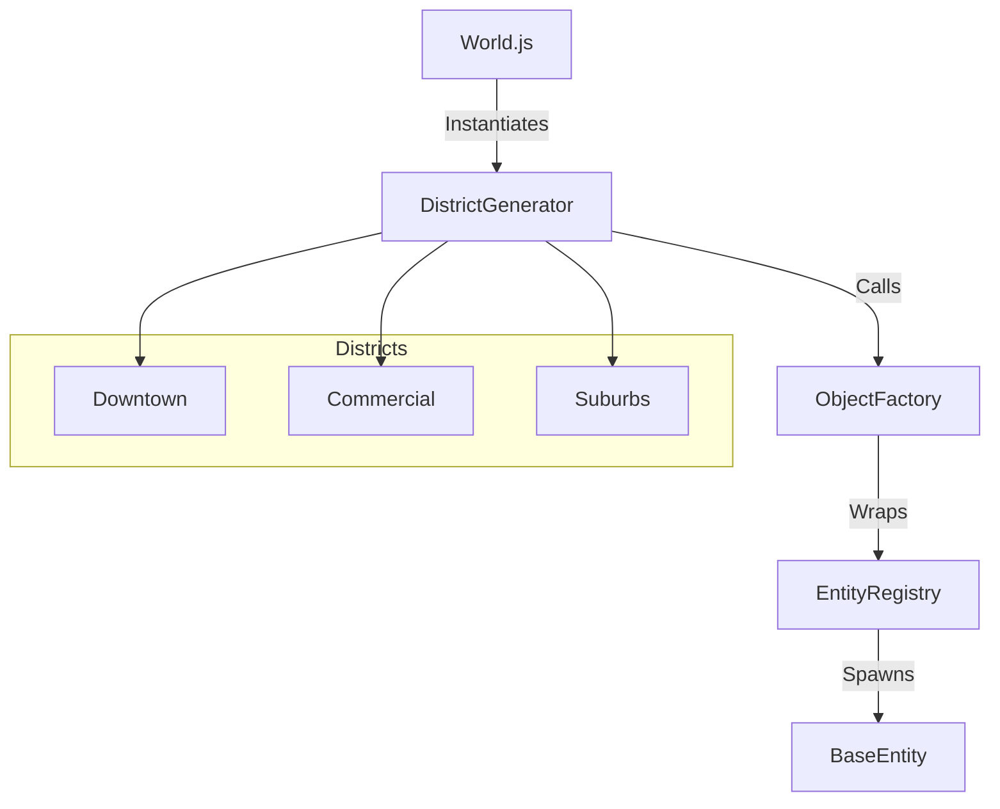

# World Generation Architecture

## Overview
The **World Generation** module (`src/world/generation.js`) is responsible for creating the initial "Blank Map" city layout when the game starts without a saved map. It uses a procedural, grid-based approach to generate distinct districts with varying density and building types.

## Architecture

The system follows a hierarchical creation flow:



### Components

1.  **`DistrictGenerator` (`src/world/generation.js`)**:
    *   The core logic controller.
    *   Defines the parameters for each district (Block Size, Street Width).
    *   Iterates through a grid to place buildings.

2.  **`ObjectFactory` (`src/world/factory.js`)**:
    *   A helper class that simplifies entity creation for the generator.
    *   Acts as an adapter for `EntityRegistry`, adding the created mesh to the scene automatically (unlike the raw Registry).

3.  **`EntityRegistry` (`src/world/entities/registry.js`)**:
    *   The underlying system that instantiates the actual Entity classes.

## Logic Flow

The generation process is triggered by `World._generateWorld()`, which calls `DistrictGenerator.generateCityLayout()`.

### 1. District Layout
The city is divided into 3 zones along the X-axis, each 200x200 units:

| Grid (X, Z) | District Type | Building Type | Block Size | Street Width |
| :--- | :--- | :--- | :--- | :--- |
| `0, 0` | **Downtown** | Skyscraper | 24 | 12 |
| `1, 0` | **Commercial** | Shop | 30 | 15 |
| `-1, 0` | **Suburbs** | House | 18 | 10 |

### 2. Building Placement
For each district:
1.  Calculates `spacing = blockSize + streetWidth`.
2.  Iterates through the zone to create a grid of buildings.
3.  **Exclusion Zone**: Skips placement if `abs(x) < 20` and `abs(z) < 20` (Center of the map) to leave the spawn area clear.

### 3. Road Generation
Currently, a single large `RoadEntity` (600x200) is generated to cover the entire city area, providing a ground plane with asphalt texture.

## Key Parameters

*   **`zoneSize`**: 200 units (The size of each district square).
*   **`CONFIG.WORLD.CHUNK_SIZE`**: Used by `SpatialHash` but distinct from generation zones.

## Usage

The generator is typically used only once during initialization (`World._generateWorld`).

```javascript
// src/world/world.js
this._generateWorld() {
    // ...
    // Hardcoded landmark
    this.factory.createSkyGardenTower(...);
}
```

**Note**: When loading a saved map (`World.loadMap`), the procedural generation is bypassed (or cleared) in favor of the serialized object list.
